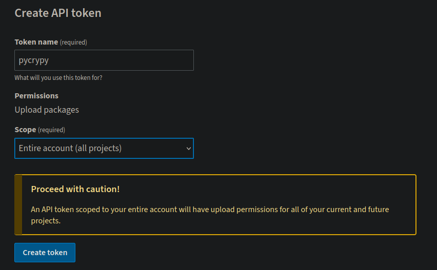

<!-- Author: Daniel Benjamin Perez Morales -->
<!-- GitHub: https://github.com/D4nitrix13 -->
<!-- GitLab: https://gitlab.com/D4nitrix13 -->
<!-- Email: danielperezdev@proton.me -->

# ***Para distribuir un paquete de Python, necesitarás preparar y subir tu paquete a un repositorio de Python, como PyPI (Python3 Package Index) o TestPyPI (un índice de paquetes de prueba).***

*[pep-0440](https://peps.python.org/pep-0440/ "https://peps.python.org/pep-0440/")*

## ***[https://pypi.org/manage/account/token/](https://pypi.org/manage/account/token/ "https://pypi.org/manage/account/token/")***

- **Propósito:** *Esta página te permite gestionar los tokens de API para tu cuenta en PyPI. Los tokens de API son una forma segura de autenticarte al publicar paquetes o interactuar con el repositorio PyPI sin necesidad de usar tu contraseña.*

- **Funcionalidades:**
  - **Crear un nuevo token:** *Puedes generar un nuevo token para usar en lugar de tu contraseña cuando subas paquetes o realices otras operaciones que requieran autenticación.*
  - **Ver tokens existentes:** *Puedes ver una lista de tokens que has creado y sus permisos asociados.*
  - **Revocar tokens:** *Puedes eliminar o revocar tokens que ya no necesitas o que creas que podrían haber sido comprometidos.*

### ***[https://test.pypi.org/manage/account/token/](https://test.pypi.org/manage/account/token/ "https://test.pypi.org/manage/account/token/")***

- **Propósito:** *Esta página es similar a la de PyPI, pero para TestPyPI. Te permite gestionar tokens de API para tu cuenta en TestPyPI, que es un entorno de prueba para paquetes de Python.*

- **Funcionalidades:**
  - **Crear un nuevo token:** *Generar un token para autenticarte al subir paquetes a TestPyPI.*
  - **Ver tokens existentes:** *Consultar los tokens que has creado para TestPyPI.*
  - **Revocar tokens:** *Eliminar tokens que ya no necesites o que creas que pueden estar comprometidos.*

### ***[https://pypi.org/help/#apitoken](https://pypi.org/help/#apitoken "https://pypi.org/help/#apitoken")***

- **Propósito:** *Esta página proporciona información y ayuda sobre el uso de tokens de API en PyPI. Ofrece detalles sobre cómo crear y utilizar tokens para autenticarte y realizar operaciones en PyPI.*

- **Contenido:**
  - **Introducción a los tokens de API:** *Explica qué son los tokens de API y por qué son útiles.*
  - **Cómo crear un token:** *Instrucciones paso a paso para generar un nuevo token desde tu cuenta en PyPI.*
  - **Uso de tokens de API:** *Información sobre cómo usar tokens para autenticarte en lugar de contraseñas al subir paquetes con herramientas como `twine` o `setuptools`.*

### ***Tokens de API***

**

**¿Qué son?**

- *Los **tokens de API** son credenciales seguras que reemplazan el uso de contraseñas para interactuar con servicios web. Se utilizan para autenticar peticiones de una manera más segura y conveniente.*

**¿Por qué usarlos?**

- **Seguridad:** *Los tokens pueden ser revocados fácilmente y no exponen tu contraseña. Esto reduce el riesgo si el token es comprometido.*
- **Permisos Granulares:** *Puedes asignar diferentes permisos a cada token, limitando su uso a operaciones específicas.*
- **Control y Gestión:** *Puedes gestionar y auditar tokens fácilmente desde las páginas de administración de tu cuenta.*

### ***Ejemplo de Uso de Tokens***

*Cuando subes un paquete con `twine`, puedes utilizar un token en lugar de una contraseña para la autenticación:*

```bash
twine upload --repository pypi dist/*
```

*En tu fichero de configuración `~/.pypirc`, puedes usar el token en lugar de una contraseña:*

```ini
[pypi]
repository = https://upload.pypi.org/legacy/
username = __token__
password = <token>

[testpypi]
repository = https://test.pypi.org/legacy/
username = __token__
password = <token>
```

*Aquí, `__token__` indica que estás usando un token en lugar de una contraseña.*

### ***En Resumen***

- **PyPI Tokens:** *Para gestionar tokens en PyPI, crear, ver, y revocar tokens para la autenticación.*
- **TestPyPI Tokens:** *Similar a PyPI, pero para el entorno de prueba TestPyPI.*
- **Guía de Tokens de API:** *Información general y ayuda sobre el uso de tokens de API en PyPI.*

*Usar tokens de API es una buena práctica para la seguridad y gestión de acceso en la distribución de paquetes de Python.*

## ***Explicación del Fichero `~/.pypirc`***

*El fichero `~/.pypirc` permite que herramientas como `twine` utilicen credenciales y configuraciones para interactuar con repositorios de paquetes. Aquí se especifican dos secciones principales: `pypi` y `testpypi`.*

### ***Estructura del Fichero***

```ini
[distutils]
index-servers =
    pypi
    testpypi
```

- **`[distutils]`:** *Esta sección define los servidores de índice a los que se puede enviar paquetes.*
- **`index-servers`:** *Lista de los servidores de índice que se usarán para las cargas. En este caso, se especifican `pypi` y `testpypi`.*

#### ***Sección `pypi`***

```ini
[pypi]
repository = https://upload.pypi.org/legacy/
username = <user>
password = <token>
```

- **`[pypi]`:** *Configuración específica para el repositorio PyPI.*
- **`repository`:** *URL del repositorio de PyPI donde se suben los paquetes.*
- **`username`:** *Tu nombre de usuario en PyPI.*
- **`password`:** *La contraseña o token de autenticación para PyPI.*

#### ***Sección `testpypi`***

```ini
[testpypi]
repository = https://test.pypi.org/legacy/
username = <user>
password = <token>
```

- **`[testpypi]`:** *Configuración específica para el repositorio TestPyPI.*
- **`repository`:** *URL del repositorio de TestPyPI.*
- **`username`:** *Tu nombre de usuario en TestPyPI.*
- **`password`:** *La contraseña o token de autenticación para TestPyPI.*

### ***Propósito de Cada Sección***

- **`[distutils]`:** *Configura los servidores de índice que `distutils` utilizará para la carga de paquetes. Esto es útil si estás usando comandos de `distutils` o `setuptools` para subir paquetes.*
  
- **`[pypi]`:** *Contiene la configuración para subir paquetes al índice principal de PyPI. Especifica la URL del repositorio, el nombre de usuario y la contraseña para la autenticación.*

- **`[testpypi]`:** *Contiene la configuración para subir paquetes al índice de prueba de TestPyPI. Similar a la sección de `pypi`, pero para el entorno de prueba.*

### ***Dónde Crear el Fichero***

**El fichero `~/.pypirc` debe ser creado en el directorio home del usuario. Esto se hace típicamente mediante:**

1. *Abriendo un editor de texto y creando el fichero `~/.pypirc`.*
2. *Insertando la configuración mencionada.*
3. *Guardando y cerrando el fichero.*

### **Ejemplo de Creación del Fichero**

**En la terminal, puedes crear el fichero usando un editor de texto como `nano`:**

```bash
nano ~/.pypirc
```

*Luego, pega el contenido de configuración en el fichero y guarda los cambios. Para salir de `nano`, presiona `Ctrl + X`, luego `Y` para confirmar los cambios, y `Enter` para guardar.*

### ***Consideraciones de Seguridad***

- **Tokens en lugar de contraseñas:** *Para mayor seguridad, es recomendable usar tokens de autenticación en lugar de contraseñas en texto claro.*
- **Permisos del fichero:** *Asegúrate de que el fichero `~/.pypirc` tenga permisos adecuados para proteger tus credenciales. Puedes ajustar los permisos con:*

  ```bash
  chmod 600 ~/.pypirc
  ```

  *Esto asegurará que solo tu usuario pueda leer y escribir en el fichero.*

**PyPI** *(Python3 Package Index) y **TestPyPI** son servicios utilizados para distribuir y probar paquetes de Python. Aquí está un resumen de cada uno:*

## ***PyPI (Python3 Package Index)***

- **Qué es:** *PyPI es el repositorio oficial y principal para paquetes de Python. Es el lugar donde los desarrolladores publican sus paquetes para que otros puedan encontrarlos, instalarlos y usarlos en sus proyectos.*

- **Uso:**
  - **Distribución:** *Permite que los desarrolladores suban sus paquetes para que estén disponibles para la comunidad de Python.*
  - **Instalación:** *Los usuarios pueden instalar paquetes desde PyPI utilizando `pip`, por ejemplo, `pip install name-package`.*

- **Características:**
  - **Alcance Global:** *Es el repositorio más grande y accesible para la comunidad de Python.*
  - **Estabilidad:** *Los paquetes aquí están destinados para el uso en producción y se espera que sean estables.*

- **Sitio web:** *[PyPI](https://pypi.org/ "https://pypi.org/")*

### ***TestPyPI***

- **Qué es:** *TestPyPI es una versión de prueba de PyPI. Está diseñado para que los desarrolladores puedan probar la distribución de sus paquetes antes de publicarlos en el PyPI oficial.*

- **Uso:**
  - **Pruebas:** *Permite a los desarrolladores probar la carga y la instalación de paquetes en un entorno que simula PyPI, sin afectar el índice principal.*
  - **Validación:** *Ofrece un entorno para verificar cómo se comportará el paquete una vez publicado.*

- **Características:**
  - **Separación de Entornos:** *TestPyPI está separado de PyPI, lo que significa que los paquetes publicados aquí no se mostrarán en el PyPI principal.*
  - **Pruebas de Integración:** *Ideal para asegurarse de que todo el proceso de carga, instalación y funcionamiento del paquete es correcto.*

- **Sitio web:** *[TestPyPI](https://test.pypi.org/ "https://test.pypi.org/")*

### ***Cómo Usar PyPI y TestPyPI***

1. **Subir a TestPyPI:** *Puedes subir tus paquetes a TestPyPI para verificar que todo funcione correctamente antes de hacer la publicación oficial. Esto te permite asegurarte de que el paquete se construye y se instala correctamente sin afectar a los usuarios finales.*

   ```bash
   twine upload --repository testpypi dist/* --verbose
   ```

2. **Subir a PyPI:** *Una vez que hayas verificado que el paquete funciona correctamente en TestPyPI, puedes proceder a subirlo a PyPI para que esté disponible para la comunidad en general.*

   ```bash
   twine upload --repository pypi dist/* --verbose
   ```

### ***Resumen***

- **PyPI:** *El repositorio principal para paquetes de Python; es el lugar donde se publican y distribuyen paquetes para uso general.*
- **TestPyPI:** *Un entorno de prueba para verificar cómo funcionará un paquete antes de su publicación en PyPI.*

*Ambos servicios son importantes en el proceso de distribución de paquetes, con TestPyPI proporcionando un entorno de prueba antes de la publicación final en PyPI.*

```ini
[distutils]
index-servers =
    pypi
    testpypi

[pypi]
repository = https://upload.pypi.org/legacy/
username = <user>
password = <token>

[testpypi]
repository = https://test.pypi.org/legacy/
username = <user>
password = <token>
```

## ***Preparar el Paquete***

- **Instalar Herramientas Necesarias**

- *Antes de comenzar, asegúrate de tener instaladas las herramientas necesarias:*

  ```bash
  pip install setuptools wheel twine
  ```

- **`setuptools`:** *Utilidad para empaquetar proyectos en Python.*
- **`wheel`:** *Proporciona un formato de fichero de distribución (`.whl`) para los paquetes de Python.*
- **`twine`:** *Herramienta para subir paquetes a PyPI o TestPyPI.*

- **Actualizar Herramientas**

  *Asegúrate de tener las versiones más recientes de estas herramientas:*

  ```bash
  pip install --upgrade setuptools twine
  ```

- **`--upgrade`:** *Actualiza las herramientas a la última versión disponible.*

- **Crear Distribuciones**

  *Dentro del directorio raíz de tu proyecto, donde está el fichero `setup.py`, ejecuta:*

  ```bash
  python3 setup.py sdist bdist_wheel
  ```

- **`sdist`:** *Crea una distribución fuente (fichero `.tar.gz`).*
- **`bdist_wheel`:** *Crea una distribución en formato wheel (`.whl`).*

**Esto generará los ficheros en el directorio `dist`.**

- *Salida Del Comando*

```bash
running sdist
running egg_info
writing src/pycrypy.egg-info/PKG-INFO
writing dependency_links to src/pycrypy.egg-info/dependency_links.txt
writing entry points to src/pycrypy.egg-info/entry_points.txt
writing requirements to src/pycrypy.egg-info/requires.txt
writing top-level names to src/pycrypy.egg-info/top_level.txt
reading manifest file 'src/pycrypy.egg-info/SOURCES.txt'
reading manifest template 'MANIFEST.in'
adding license file 'LICENSE.es.md'
adding license file 'LICENSE.md'
writing manifest file 'src/pycrypy.egg-info/SOURCES.txt'
running check
creating pycrypy-1.0.0.dev0
creating pycrypy-1.0.0.dev0/dist
creating pycrypy-1.0.0.dev0/src/cli
creating pycrypy-1.0.0.dev0/src/config
creating pycrypy-1.0.0.dev0/src/dark_themes
creating pycrypy-1.0.0.dev0/src/lib
creating pycrypy-1.0.0.dev0/src/light_themes
creating pycrypy-1.0.0.dev0/src/pycrypy.egg-info
creating pycrypy-1.0.0.dev0/src/recommended_themes
copying files to pycrypy-1.0.0.dev0...
copying CODE_OF_CONDUCT.md -> pycrypy-1.0.0.dev0
copying CODIGO_CONDUCTA.md -> pycrypy-1.0.0.dev0
copying CONTRIBUCION.md -> pycrypy-1.0.0.dev0
copying LICENSE.es.md -> pycrypy-1.0.0.dev0
copying LICENSE.md -> pycrypy-1.0.0.dev0
copying MANIFEST.in -> pycrypy-1.0.0.dev0
copying README.es.md -> pycrypy-1.0.0.dev0
copying README.md -> pycrypy-1.0.0.dev0
copying SECURITY.es.md -> pycrypy-1.0.0.dev0
copying SECURITY.md -> pycrypy-1.0.0.dev0
copying pycrypy.spec -> pycrypy-1.0.0.dev0
copying pyproject.toml -> pycrypy-1.0.0.dev0
copying requirements.txt -> pycrypy-1.0.0.dev0
copying setup.py -> pycrypy-1.0.0.dev0
copying dist/pycrypy-1.0.0.dev0-py3-none-any.whl -> pycrypy-1.0.0.dev0/dist
copying dist/pycrypy-1.0.0.dev0.tar.gz -> pycrypy-1.0.0.dev0/dist
copying src/cli/__init__.py -> pycrypy-1.0.0.dev0/src/cli
copying src/cli/cli.py -> pycrypy-1.0.0.dev0/src/cli
copying src/cli/main.py -> pycrypy-1.0.0.dev0/src/cli
copying src/config/__init__.py -> pycrypy-1.0.0.dev0/src/config
copying src/config/errors.py -> pycrypy-1.0.0.dev0/src/config
copying src/config/path.py -> pycrypy-1.0.0.dev0/src/config
copying src/config/themes.py -> pycrypy-1.0.0.dev0/src/config
copying src/dark_themes/Cobalt2.py -> pycrypy-1.0.0.dev0/src/dark_themes
copying src/dark_themes/Mariana.py -> pycrypy-1.0.0.dev0/src/dark_themes
copying src/dark_themes/__init__.py -> pycrypy-1.0.0.dev0/src/dark_themes
copying src/dark_themes/afterglow.py -> pycrypy-1.0.0.dev0/src/dark_themes
copying src/dark_themes/alacritty_0_12.py -> pycrypy-1.0.0.dev0/src/dark_themes
copying src/dark_themes/ashes_dark.py -> pycrypy-1.0.0.dev0/src/dark_themes
copying src/dark_themes/base16_default_dark.py -> pycrypy-1.0.0.dev0/src/dark_themes
copying src/dark_themes/bluish.py -> pycrypy-1.0.0.dev0/src/dark_themes
copying src/dark_themes/breeze.py -> pycrypy-1.0.0.dev0/src/dark_themes
copying src/dark_themes/catppuccin_frappe.py -> pycrypy-1.0.0.dev0/src/dark_themes
copying src/dark_themes/catppuccin_macchiato.py -> pycrypy-1.0.0.dev0/src/dark_themes
copying src/dark_themes/catppuccin_mocha.py -> pycrypy-1.0.0.dev0/src/dark_themes
copying src/dark_themes/chicago95.py -> pycrypy-1.0.0.dev0/src/dark_themes
copying src/dark_themes/citylights.py -> pycrypy-1.0.0.dev0/src/dark_themes
copying src/dark_themes/dark_pastels.py -> pycrypy-1.0.0.dev0/src/dark_themes
copying src/dark_themes/deep_space.py -> pycrypy-1.0.0.dev0/src/dark_themes
copying src/dark_themes/doom_one.py -> pycrypy-1.0.0.dev0/src/dark_themes
copying src/dark_themes/dracula_plus.py -> pycrypy-1.0.0.dev0/src/dark_themes
copying src/dark_themes/enfocado_dark.py -> pycrypy-1.0.0.dev0/src/dark_themes
copying src/dark_themes/everforest_dark.py -> pycrypy-1.0.0.dev0/src/dark_themes
copying src/dark_themes/falcon.py -> pycrypy-1.0.0.dev0/src/dark_themes
copying src/dark_themes/flat_remix.py -> pycrypy-1.0.0.dev0/src/dark_themes
copying src/dark_themes/flexoki.py -> pycrypy-1.0.0.dev0/src/dark_themes
copying src/dark_themes/github_dark.py -> pycrypy-1.0.0.dev0/src/dark_themes
copying src/dark_themes/github_dark_dimmed.py -> pycrypy-1.0.0.dev0/src/dark_themes
copying src/dark_themes/gnome_terminal.py -> pycrypy-1.0.0.dev0/src/dark_themes
copying src/dark_themes/google.py -> pycrypy-1.0.0.dev0/src/dark_themes
copying src/dark_themes/gruvbox_dark.py -> pycrypy-1.0.0.dev0/src/dark_themes
copying src/dark_themes/gruvbox_material.py -> pycrypy-1.0.0.dev0/src/dark_themes
copying src/dark_themes/gruvbox_material_hard_dark.py -> pycrypy-1.0.0.dev0/src/dark_themes
copying src/dark_themes/gruvbox_material_medium_dark.py -> pycrypy-1.0.0.dev0/src/dark_themes
copying src/dark_themes/hardhacker.py -> pycrypy-1.0.0.dev0/src/dark_themes
copying src/dark_themes/hatsunemiku.py -> pycrypy-1.0.0.dev0/src/dark_themes
copying src/dark_themes/horizon_dark.py -> pycrypy-1.0.0.dev0/src/dark_themes
copying src/dark_themes/inferno.py -> pycrypy-1.0.0.dev0/src/dark_themes
copying src/dark_themes/iris.py -> pycrypy-1.0.0.dev0/src/dark_themes
copying src/dark_themes/kanagawa_dragon.py -> pycrypy-1.0.0.dev0/src/dark_themes
copying src/dark_themes/kanagawa_wave.py -> pycrypy-1.0.0.dev0/src/dark_themes
copying src/dark_themes/konsole_linux.py -> pycrypy-1.0.0.dev0/src/dark_themes
copying src/dark_themes/low_contrast.py -> pycrypy-1.0.0.dev0/src/dark_themes
copying src/dark_themes/marine_dark.py -> pycrypy-1.0.0.dev0/src/dark_themes
copying src/dark_themes/material_theme.py -> pycrypy-1.0.0.dev0/src/dark_themes
copying src/dark_themes/meliora.py -> pycrypy-1.0.0.dev0/src/dark_themes
copying src/dark_themes/monokai.py -> pycrypy-1.0.0.dev0/src/dark_themes
copying src/dark_themes/monokai_pro.py -> pycrypy-1.0.0.dev0/src/dark_themes
copying src/dark_themes/moonlight_ii_vscode.py -> pycrypy-1.0.0.dev0/src/dark_themes
copying src/dark_themes/nightfox.py -> pycrypy-1.0.0.dev0/src/dark_themes
copying src/dark_themes/nord.py -> pycrypy-1.0.0.dev0/src/dark_themes
copying src/dark_themes/one_dark.py -> pycrypy-1.0.0.dev0/src/dark_themes
copying src/dark_themes/papercolor_dark.py -> pycrypy-1.0.0.dev0/src/dark_themes
copying src/dark_themes/pencil_dark.py -> pycrypy-1.0.0.dev0/src/dark_themes
copying src/dark_themes/rainbow.py -> pycrypy-1.0.0.dev0/src/dark_themes
copying src/dark_themes/remedy_dark.py -> pycrypy-1.0.0.dev0/src/dark_themes
copying src/dark_themes/rose_pine_moon.py -> pycrypy-1.0.0.dev0/src/dark_themes
copying src/dark_themes/seashells.py -> pycrypy-1.0.0.dev0/src/dark_themes
copying src/dark_themes/smoooooth.py -> pycrypy-1.0.0.dev0/src/dark_themes
copying src/dark_themes/snazzy.py -> pycrypy-1.0.0.dev0/src/dark_themes
copying src/dark_themes/solarized_dark.py -> pycrypy-1.0.0.dev0/src/dark_themes
copying src/dark_themes/solarized_osaka.py -> pycrypy-1.0.0.dev0/src/dark_themes
copying src/dark_themes/taerminal.py -> pycrypy-1.0.0.dev0/src/dark_themes
copying src/dark_themes/tango_dark.py -> pycrypy-1.0.0.dev0/src/dark_themes
copying src/dark_themes/tender.py -> pycrypy-1.0.0.dev0/src/dark_themes
copying src/dark_themes/terminal_app.py -> pycrypy-1.0.0.dev0/src/dark_themes
copying src/dark_themes/tomorrow_night.py -> pycrypy-1.0.0.dev0/src/dark_themes
copying src/dark_themes/tomorrow_night_bright.py -> pycrypy-1.0.0.dev0/src/dark_themes
copying src/dark_themes/ubuntu.py -> pycrypy-1.0.0.dev0/src/dark_themes
copying src/dark_themes/vesper.py -> pycrypy-1.0.0.dev0/src/dark_themes
copying src/dark_themes/wombat.py -> pycrypy-1.0.0.dev0/src/dark_themes
copying src/dark_themes/zenburn.py -> pycrypy-1.0.0.dev0/src/dark_themes
copying src/lib/__init__.py -> pycrypy-1.0.0.dev0/src/lib
copying src/lib/alacritty_key.py -> pycrypy-1.0.0.dev0/src/lib
copying src/lib/change_cursor_blinking.py -> pycrypy-1.0.0.dev0/src/lib
copying src/lib/change_cursor_shape.py -> pycrypy-1.0.0.dev0/src/lib
copying src/lib/change_cursor_thickness.py -> pycrypy-1.0.0.dev0/src/lib
copying src/lib/change_font.py -> pycrypy-1.0.0.dev0/src/lib
copying src/lib/change_font_size.py -> pycrypy-1.0.0.dev0/src/lib
copying src/lib/change_font_style.py -> pycrypy-1.0.0.dev0/src/lib
copying src/lib/change_opacity.py -> pycrypy-1.0.0.dev0/src/lib
copying src/lib/change_padding.py -> pycrypy-1.0.0.dev0/src/lib
copying src/lib/change_theme_path.py -> pycrypy-1.0.0.dev0/src/lib
copying src/lib/format_ansi_color.py -> pycrypy-1.0.0.dev0/src/lib
copying src/lib/list_dark_themes.py -> pycrypy-1.0.0.dev0/src/lib
copying src/lib/list_light_themes.py -> pycrypy-1.0.0.dev0/src/lib
copying src/lib/list_recommended_themes.py -> pycrypy-1.0.0.dev0/src/lib
copying src/lib/load_new_theme.py -> pycrypy-1.0.0.dev0/src/lib
copying src/light_themes/__init__.py -> pycrypy-1.0.0.dev0/src/light_themes
copying src/light_themes/alabaster.py -> pycrypy-1.0.0.dev0/src/light_themes
copying src/light_themes/ashes_light.py -> pycrypy-1.0.0.dev0/src/light_themes
copying src/light_themes/atom_one_light.py -> pycrypy-1.0.0.dev0/src/light_themes
copying src/light_themes/ayu_light.py -> pycrypy-1.0.0.dev0/src/light_themes
copying src/light_themes/catppuccin_latte.py -> pycrypy-1.0.0.dev0/src/light_themes
copying src/light_themes/enfocado_light.py -> pycrypy-1.0.0.dev0/src/light_themes
copying src/light_themes/everforest_light.py -> pycrypy-1.0.0.dev0/src/light_themes
copying src/light_themes/github_light.py -> pycrypy-1.0.0.dev0/src/light_themes
copying src/light_themes/github_light_colorblind.py -> pycrypy-1.0.0.dev0/src/light_themes
copying src/light_themes/github_light_default.py -> pycrypy-1.0.0.dev0/src/light_themes
copying src/light_themes/github_light_high_contrast.py -> pycrypy-1.0.0.dev0/src/light_themes
copying src/light_themes/github_light_tritanopia.py -> pycrypy-1.0.0.dev0/src/light_themes
copying src/light_themes/gruvbox_light.py -> pycrypy-1.0.0.dev0/src/light_themes
copying src/light_themes/gruvbox_material_hard_light.py -> pycrypy-1.0.0.dev0/src/light_themes
copying src/light_themes/gruvbox_material_medium_light.py -> pycrypy-1.0.0.dev0/src/light_themes
copying src/light_themes/high_contrast.py -> pycrypy-1.0.0.dev0/src/light_themes
copying src/light_themes/msx.py -> pycrypy-1.0.0.dev0/src/light_themes
copying src/light_themes/night_owlish_light.py -> pycrypy-1.0.0.dev0/src/light_themes
copying src/light_themes/noctis_lux.py -> pycrypy-1.0.0.dev0/src/light_themes
copying src/light_themes/nord_light.py -> pycrypy-1.0.0.dev0/src/light_themes
copying src/light_themes/papercolor_light.py -> pycrypy-1.0.0.dev0/src/light_themes
copying src/light_themes/papertheme.py -> pycrypy-1.0.0.dev0/src/light_themes
copying src/light_themes/pencil_light.py -> pycrypy-1.0.0.dev0/src/light_themes
copying src/light_themes/rose_pine_dawn.py -> pycrypy-1.0.0.dev0/src/light_themes
copying src/light_themes/solarized_light.py -> pycrypy-1.0.0.dev0/src/light_themes
copying src/pycrypy.egg-info/PKG-INFO -> pycrypy-1.0.0.dev0/src/pycrypy.egg-info
copying src/pycrypy.egg-info/SOURCES.txt -> pycrypy-1.0.0.dev0/src/pycrypy.egg-info
copying src/pycrypy.egg-info/dependency_links.txt -> pycrypy-1.0.0.dev0/src/pycrypy.egg-info
copying src/pycrypy.egg-info/entry_points.txt -> pycrypy-1.0.0.dev0/src/pycrypy.egg-info
copying src/pycrypy.egg-info/requires.txt -> pycrypy-1.0.0.dev0/src/pycrypy.egg-info
copying src/pycrypy.egg-info/top_level.txt -> pycrypy-1.0.0.dev0/src/pycrypy.egg-info
copying src/recommended_themes/__init__.py -> pycrypy-1.0.0.dev0/src/recommended_themes
copying src/recommended_themes/alabaster_dark.py -> pycrypy-1.0.0.dev0/src/recommended_themes
copying src/recommended_themes/argonaut.py -> pycrypy-1.0.0.dev0/src/recommended_themes
copying src/recommended_themes/aura.py -> pycrypy-1.0.0.dev0/src/recommended_themes
copying src/recommended_themes/ayu_dark.py -> pycrypy-1.0.0.dev0/src/recommended_themes
copying src/recommended_themes/ayu_mirage.py -> pycrypy-1.0.0.dev0/src/recommended_themes
copying src/recommended_themes/baitong.py -> pycrypy-1.0.0.dev0/src/recommended_themes
copying src/recommended_themes/blood_moon.py -> pycrypy-1.0.0.dev0/src/recommended_themes
copying src/recommended_themes/bluescreen.py -> pycrypy-1.0.0.dev0/src/recommended_themes
copying src/recommended_themes/campbell.py -> pycrypy-1.0.0.dev0/src/recommended_themes
copying src/recommended_themes/carbonfox.py -> pycrypy-1.0.0.dev0/src/recommended_themes
copying src/recommended_themes/catppuccin.py -> pycrypy-1.0.0.dev0/src/recommended_themes
copying src/recommended_themes/challenger_deep.py -> pycrypy-1.0.0.dev0/src/recommended_themes
copying src/recommended_themes/cyber_punk_neon.py -> pycrypy-1.0.0.dev0/src/recommended_themes
copying src/recommended_themes/dark_pride.py -> pycrypy-1.0.0.dev0/src/recommended_themes
copying src/recommended_themes/dracula.py -> pycrypy-1.0.0.dev0/src/recommended_themes
copying src/recommended_themes/dracula_inspired.py -> pycrypy-1.0.0.dev0/src/recommended_themes
copying src/recommended_themes/github_dark_colorblind.py -> pycrypy-1.0.0.dev0/src/recommended_themes
copying src/recommended_themes/github_dark_default.py -> pycrypy-1.0.0.dev0/src/recommended_themes
copying src/recommended_themes/github_dark_high_contrast.py -> pycrypy-1.0.0.dev0/src/recommended_themes
copying src/recommended_themes/github_dark_tritanopia.py -> pycrypy-1.0.0.dev0/src/recommended_themes
copying src/recommended_themes/gotham.py -> pycrypy-1.0.0.dev0/src/recommended_themes
copying src/recommended_themes/greenscreen.py -> pycrypy-1.0.0.dev0/src/recommended_themes
copying src/recommended_themes/hyper.py -> pycrypy-1.0.0.dev0/src/recommended_themes
copying src/recommended_themes/iterm.py -> pycrypy-1.0.0.dev0/src/recommended_themes
copying src/recommended_themes/material_darker.py -> pycrypy-1.0.0.dev0/src/recommended_themes
copying src/recommended_themes/material_ocean.py -> pycrypy-1.0.0.dev0/src/recommended_themes
copying src/recommended_themes/material_theme_mod.py -> pycrypy-1.0.0.dev0/src/recommended_themes
copying src/recommended_themes/midnight_haze.py -> pycrypy-1.0.0.dev0/src/recommended_themes
copying src/recommended_themes/monokai_charcoal.py -> pycrypy-1.0.0.dev0/src/recommended_themes
copying src/recommended_themes/monokai_inspired.py -> pycrypy-1.0.0.dev0/src/recommended_themes
copying src/recommended_themes/night_owl.py -> pycrypy-1.0.0.dev0/src/recommended_themes
copying src/recommended_themes/nightfly.py -> pycrypy-1.0.0.dev0/src/recommended_themes
copying src/recommended_themes/nord_inspired.py -> pycrypy-1.0.0.dev0/src/recommended_themes
copying src/recommended_themes/nord_wave.py -> pycrypy-1.0.0.dev0/src/recommended_themes
copying src/recommended_themes/nordic.py -> pycrypy-1.0.0.dev0/src/recommended_themes
copying src/recommended_themes/oceanic_next.py -> pycrypy-1.0.0.dev0/src/recommended_themes
copying src/recommended_themes/omni.py -> pycrypy-1.0.0.dev0/src/recommended_themes
copying src/recommended_themes/onedark_inspired.py -> pycrypy-1.0.0.dev0/src/recommended_themes
copying src/recommended_themes/palenight.py -> pycrypy-1.0.0.dev0/src/recommended_themes
copying src/recommended_themes/pastel_dark.py -> pycrypy-1.0.0.dev0/src/recommended_themes
copying src/recommended_themes/rose_pine.py -> pycrypy-1.0.0.dev0/src/recommended_themes
copying src/recommended_themes/rosepine_inspired.py -> pycrypy-1.0.0.dev0/src/recommended_themes
copying src/recommended_themes/thelovelace.py -> pycrypy-1.0.0.dev0/src/recommended_themes
copying src/recommended_themes/tokyo_night.py -> pycrypy-1.0.0.dev0/src/recommended_themes
copying src/recommended_themes/tokyo_night_storm.py -> pycrypy-1.0.0.dev0/src/recommended_themes
copying src/recommended_themes/xterm.py -> pycrypy-1.0.0.dev0/src/recommended_themes
copying src/pycrypy.egg-info/SOURCES.txt -> pycrypy-1.0.0.dev0/src/pycrypy.egg-info
Writing pycrypy-1.0.0.dev0/setup.cfg
Creating tar archive
removing 'pycrypy-1.0.0.dev0' (and everything under it)
running bdist_wheel
running build
running build_py
creating build/lib/lib
copying src/lib/change_cursor_shape.py -> build/lib/lib
copying src/lib/change_padding.py -> build/lib/lib
copying src/lib/alacritty_key.py -> build/lib/lib
copying src/lib/change_font_style.py -> build/lib/lib
copying src/lib/change_cursor_thickness.py -> build/lib/lib
copying src/lib/change_theme_path.py -> build/lib/lib
copying src/lib/list_light_themes.py -> build/lib/lib
copying src/lib/change_cursor_blinking.py -> build/lib/lib
copying src/lib/change_font_size.py -> build/lib/lib
copying src/lib/change_font.py -> build/lib/lib
copying src/lib/change_opacity.py -> build/lib/lib
copying src/lib/__init__.py -> build/lib/lib
copying src/lib/format_ansi_color.py -> build/lib/lib
copying src/lib/list_recommended_themes.py -> build/lib/lib
copying src/lib/load_new_theme.py -> build/lib/lib
copying src/lib/list_dark_themes.py -> build/lib/lib
creating build/lib/light_themes
copying src/light_themes/catppuccin_latte.py -> build/lib/light_themes
copying src/light_themes/night_owlish_light.py -> build/lib/light_themes
copying src/light_themes/github_light_high_contrast.py -> build/lib/light_themes
copying src/light_themes/gruvbox_material_medium_light.py -> build/lib/light_themes
copying src/light_themes/ayu_light.py -> build/lib/light_themes
copying src/light_themes/enfocado_light.py -> build/lib/light_themes
copying src/light_themes/papercolor_light.py -> build/lib/light_themes
copying src/light_themes/solarized_light.py -> build/lib/light_themes
copying src/light_themes/high_contrast.py -> build/lib/light_themes
copying src/light_themes/github_light_tritanopia.py -> build/lib/light_themes
copying src/light_themes/pencil_light.py -> build/lib/light_themes
copying src/light_themes/__init__.py -> build/lib/light_themes
copying src/light_themes/gruvbox_light.py -> build/lib/light_themes
copying src/light_themes/ashes_light.py -> build/lib/light_themes
copying src/light_themes/atom_one_light.py -> build/lib/light_themes
copying src/light_themes/rose_pine_dawn.py -> build/lib/light_themes
copying src/light_themes/github_light.py -> build/lib/light_themes
copying src/light_themes/github_light_colorblind.py -> build/lib/light_themes
copying src/light_themes/alabaster.py -> build/lib/light_themes
copying src/light_themes/msx.py -> build/lib/light_themes
copying src/light_themes/noctis_lux.py -> build/lib/light_themes
copying src/light_themes/github_light_default.py -> build/lib/light_themes
copying src/light_themes/papertheme.py -> build/lib/light_themes
copying src/light_themes/everforest_light.py -> build/lib/light_themes
copying src/light_themes/gruvbox_material_hard_light.py -> build/lib/light_themes
copying src/light_themes/nord_light.py -> build/lib/light_themes
creating build/lib/cli
copying src/cli/cli.py -> build/lib/cli
copying src/cli/__init__.py -> build/lib/cli
copying src/cli/main.py -> build/lib/cli
creating build/lib/dark_themes
copying src/dark_themes/monokai_pro.py -> build/lib/dark_themes
copying src/dark_themes/github_dark_dimmed.py -> build/lib/dark_themes
copying src/dark_themes/taerminal.py -> build/lib/dark_themes
copying src/dark_themes/moonlight_ii_vscode.py -> build/lib/dark_themes
copying src/dark_themes/deep_space.py -> build/lib/dark_themes
copying src/dark_themes/solarized_dark.py -> build/lib/dark_themes
copying src/dark_themes/tender.py -> build/lib/dark_themes
copying src/dark_themes/rose_pine_moon.py -> build/lib/dark_themes
copying src/dark_themes/tango_dark.py -> build/lib/dark_themes
copying src/dark_themes/material_theme.py -> build/lib/dark_themes
copying src/dark_themes/google.py -> build/lib/dark_themes
copying src/dark_themes/falcon.py -> build/lib/dark_themes
copying src/dark_themes/nord.py -> build/lib/dark_themes
copying src/dark_themes/remedy_dark.py -> build/lib/dark_themes
copying src/dark_themes/doom_one.py -> build/lib/dark_themes
copying src/dark_themes/zenburn.py -> build/lib/dark_themes
copying src/dark_themes/Cobalt2.py -> build/lib/dark_themes
copying src/dark_themes/hardhacker.py -> build/lib/dark_themes
copying src/dark_themes/rainbow.py -> build/lib/dark_themes
copying src/dark_themes/dracula_plus.py -> build/lib/dark_themes
copying src/dark_themes/base16_default_dark.py -> build/lib/dark_themes
copying src/dark_themes/github_dark.py -> build/lib/dark_themes
copying src/dark_themes/konsole_linux.py -> build/lib/dark_themes
copying src/dark_themes/monokai.py -> build/lib/dark_themes
copying src/dark_themes/terminal_app.py -> build/lib/dark_themes
copying src/dark_themes/ashes_dark.py -> build/lib/dark_themes
copying src/dark_themes/ubuntu.py -> build/lib/dark_themes
copying src/dark_themes/Mariana.py -> build/lib/dark_themes
copying src/dark_themes/horizon_dark.py -> build/lib/dark_themes
copying src/dark_themes/catppuccin_mocha.py -> build/lib/dark_themes
copying src/dark_themes/__init__.py -> build/lib/dark_themes
copying src/dark_themes/everforest_dark.py -> build/lib/dark_themes
copying src/dark_themes/dark_pastels.py -> build/lib/dark_themes
copying src/dark_themes/one_dark.py -> build/lib/dark_themes
copying src/dark_themes/marine_dark.py -> build/lib/dark_themes
copying src/dark_themes/chicago95.py -> build/lib/dark_themes
copying src/dark_themes/snazzy.py -> build/lib/dark_themes
copying src/dark_themes/tomorrow_night_bright.py -> build/lib/dark_themes
copying src/dark_themes/nightfox.py -> build/lib/dark_themes
copying src/dark_themes/tomorrow_night.py -> build/lib/dark_themes
copying src/dark_themes/solarized_osaka.py -> build/lib/dark_themes
copying src/dark_themes/gruvbox_dark.py -> build/lib/dark_themes
copying src/dark_themes/gruvbox_material_medium_dark.py -> build/lib/dark_themes
copying src/dark_themes/low_contrast.py -> build/lib/dark_themes
copying src/dark_themes/gnome_terminal.py -> build/lib/dark_themes
copying src/dark_themes/pencil_dark.py -> build/lib/dark_themes
copying src/dark_themes/catppuccin_frappe.py -> build/lib/dark_themes
copying src/dark_themes/kanagawa_dragon.py -> build/lib/dark_themes
copying src/dark_themes/wombat.py -> build/lib/dark_themes
copying src/dark_themes/alacritty_0_12.py -> build/lib/dark_themes
copying src/dark_themes/seashells.py -> build/lib/dark_themes
copying src/dark_themes/enfocado_dark.py -> build/lib/dark_themes
copying src/dark_themes/smoooooth.py -> build/lib/dark_themes
copying src/dark_themes/catppuccin_macchiato.py -> build/lib/dark_themes
copying src/dark_themes/bluish.py -> build/lib/dark_themes
copying src/dark_themes/hatsunemiku.py -> build/lib/dark_themes
copying src/dark_themes/breeze.py -> build/lib/dark_themes
copying src/dark_themes/gruvbox_material.py -> build/lib/dark_themes
copying src/dark_themes/meliora.py -> build/lib/dark_themes
copying src/dark_themes/inferno.py -> build/lib/dark_themes
copying src/dark_themes/papercolor_dark.py -> build/lib/dark_themes
copying src/dark_themes/citylights.py -> build/lib/dark_themes
copying src/dark_themes/flexoki.py -> build/lib/dark_themes
copying src/dark_themes/gruvbox_material_hard_dark.py -> build/lib/dark_themes
copying src/dark_themes/afterglow.py -> build/lib/dark_themes
copying src/dark_themes/vesper.py -> build/lib/dark_themes
copying src/dark_themes/flat_remix.py -> build/lib/dark_themes
copying src/dark_themes/iris.py -> build/lib/dark_themes
copying src/dark_themes/kanagawa_wave.py -> build/lib/dark_themes
creating build/lib/config
copying src/config/themes.py -> build/lib/config
copying src/config/errors.py -> build/lib/config
copying src/config/path.py -> build/lib/config
copying src/config/__init__.py -> build/lib/config
creating build/lib/recommended_themes
copying src/recommended_themes/baitong.py -> build/lib/recommended_themes
copying src/recommended_themes/onedark_inspired.py -> build/lib/recommended_themes
copying src/recommended_themes/dark_pride.py -> build/lib/recommended_themes
copying src/recommended_themes/gotham.py -> build/lib/recommended_themes
copying src/recommended_themes/challenger_deep.py -> build/lib/recommended_themes
copying src/recommended_themes/omni.py -> build/lib/recommended_themes
copying src/recommended_themes/xterm.py -> build/lib/recommended_themes
copying src/recommended_themes/carbonfox.py -> build/lib/recommended_themes
copying src/recommended_themes/nord_inspired.py -> build/lib/recommended_themes
copying src/recommended_themes/tokyo_night.py -> build/lib/recommended_themes
copying src/recommended_themes/ayu_mirage.py -> build/lib/recommended_themes
copying src/recommended_themes/campbell.py -> build/lib/recommended_themes
copying src/recommended_themes/__init__.py -> build/lib/recommended_themes
copying src/recommended_themes/greenscreen.py -> build/lib/recommended_themes
copying src/recommended_themes/dracula_inspired.py -> build/lib/recommended_themes
copying src/recommended_themes/github_dark_default.py -> build/lib/recommended_themes
copying src/recommended_themes/iterm.py -> build/lib/recommended_themes
copying src/recommended_themes/monokai_charcoal.py -> build/lib/recommended_themes
copying src/recommended_themes/nightfly.py -> build/lib/recommended_themes
copying src/recommended_themes/monokai_inspired.py -> build/lib/recommended_themes
copying src/recommended_themes/ayu_dark.py -> build/lib/recommended_themes
copying src/recommended_themes/bluescreen.py -> build/lib/recommended_themes
copying src/recommended_themes/nord_wave.py -> build/lib/recommended_themes
copying src/recommended_themes/github_dark_high_contrast.py -> build/lib/recommended_themes
copying src/recommended_themes/catppuccin.py -> build/lib/recommended_themes
copying src/recommended_themes/thelovelace.py -> build/lib/recommended_themes
copying src/recommended_themes/pastel_dark.py -> build/lib/recommended_themes
copying src/recommended_themes/night_owl.py -> build/lib/recommended_themes
copying src/recommended_themes/github_dark_tritanopia.py -> build/lib/recommended_themes
copying src/recommended_themes/alabaster_dark.py -> build/lib/recommended_themes
copying src/recommended_themes/oceanic_next.py -> build/lib/recommended_themes
copying src/recommended_themes/github_dark_colorblind.py -> build/lib/recommended_themes
copying src/recommended_themes/nordic.py -> build/lib/recommended_themes
copying src/recommended_themes/midnight_haze.py -> build/lib/recommended_themes
copying src/recommended_themes/argonaut.py -> build/lib/recommended_themes
copying src/recommended_themes/cyber_punk_neon.py -> build/lib/recommended_themes
copying src/recommended_themes/blood_moon.py -> build/lib/recommended_themes
copying src/recommended_themes/hyper.py -> build/lib/recommended_themes
copying src/recommended_themes/material_theme_mod.py -> build/lib/recommended_themes
copying src/recommended_themes/aura.py -> build/lib/recommended_themes
copying src/recommended_themes/palenight.py -> build/lib/recommended_themes
copying src/recommended_themes/rose_pine.py -> build/lib/recommended_themes
copying src/recommended_themes/rosepine_inspired.py -> build/lib/recommended_themes
copying src/recommended_themes/material_ocean.py -> build/lib/recommended_themes
copying src/recommended_themes/material_darker.py -> build/lib/recommended_themes
copying src/recommended_themes/tokyo_night_storm.py -> build/lib/recommended_themes
copying src/recommended_themes/dracula.py -> build/lib/recommended_themes
/home/d4nitrix13/pycrypy/.venv/lib/python3.13/site-packages/setuptools/_distutils/cmd.py:90: SetuptoolsDeprecationWarning: setup.py install is deprecated.
!!

        ********************************************************************************
        Please avoid running ``setup.py`` directly.
        Instead, use pypa/build, pypa/installer or other
        standards-based tools.

        See https://blog.ganssle.io/articles/2021/10/setup-py-deprecated.html for details.
        ********************************************************************************

!!
  self.initialize_options()
installing to build/bdist.linux-x86_64/wheel
running install
running install_lib
creating build/bdist.linux-x86_64/wheel
creating build/bdist.linux-x86_64/wheel/lib
copying build/lib/lib/change_cursor_shape.py -> build/bdist.linux-x86_64/wheel/./lib
copying build/lib/lib/change_padding.py -> build/bdist.linux-x86_64/wheel/./lib
copying build/lib/lib/alacritty_key.py -> build/bdist.linux-x86_64/wheel/./lib
copying build/lib/lib/change_font_style.py -> build/bdist.linux-x86_64/wheel/./lib
copying build/lib/lib/change_cursor_thickness.py -> build/bdist.linux-x86_64/wheel/./lib
copying build/lib/lib/change_theme_path.py -> build/bdist.linux-x86_64/wheel/./lib
copying build/lib/lib/list_light_themes.py -> build/bdist.linux-x86_64/wheel/./lib
copying build/lib/lib/change_cursor_blinking.py -> build/bdist.linux-x86_64/wheel/./lib
copying build/lib/lib/change_font_size.py -> build/bdist.linux-x86_64/wheel/./lib
copying build/lib/lib/change_font.py -> build/bdist.linux-x86_64/wheel/./lib
copying build/lib/lib/change_opacity.py -> build/bdist.linux-x86_64/wheel/./lib
copying build/lib/lib/__init__.py -> build/bdist.linux-x86_64/wheel/./lib
copying build/lib/lib/format_ansi_color.py -> build/bdist.linux-x86_64/wheel/./lib
copying build/lib/lib/list_recommended_themes.py -> build/bdist.linux-x86_64/wheel/./lib
copying build/lib/lib/load_new_theme.py -> build/bdist.linux-x86_64/wheel/./lib
copying build/lib/lib/list_dark_themes.py -> build/bdist.linux-x86_64/wheel/./lib
creating build/bdist.linux-x86_64/wheel/light_themes
copying build/lib/light_themes/catppuccin_latte.py -> build/bdist.linux-x86_64/wheel/./light_themes
copying build/lib/light_themes/night_owlish_light.py -> build/bdist.linux-x86_64/wheel/./light_themes
copying build/lib/light_themes/github_light_high_contrast.py -> build/bdist.linux-x86_64/wheel/./light_themes
copying build/lib/light_themes/gruvbox_material_medium_light.py -> build/bdist.linux-x86_64/wheel/./light_themes
copying build/lib/light_themes/ayu_light.py -> build/bdist.linux-x86_64/wheel/./light_themes
copying build/lib/light_themes/enfocado_light.py -> build/bdist.linux-x86_64/wheel/./light_themes
copying build/lib/light_themes/papercolor_light.py -> build/bdist.linux-x86_64/wheel/./light_themes
copying build/lib/light_themes/solarized_light.py -> build/bdist.linux-x86_64/wheel/./light_themes
copying build/lib/light_themes/high_contrast.py -> build/bdist.linux-x86_64/wheel/./light_themes
copying build/lib/light_themes/github_light_tritanopia.py -> build/bdist.linux-x86_64/wheel/./light_themes
copying build/lib/light_themes/pencil_light.py -> build/bdist.linux-x86_64/wheel/./light_themes
copying build/lib/light_themes/__init__.py -> build/bdist.linux-x86_64/wheel/./light_themes
copying build/lib/light_themes/gruvbox_light.py -> build/bdist.linux-x86_64/wheel/./light_themes
copying build/lib/light_themes/ashes_light.py -> build/bdist.linux-x86_64/wheel/./light_themes
copying build/lib/light_themes/atom_one_light.py -> build/bdist.linux-x86_64/wheel/./light_themes
copying build/lib/light_themes/rose_pine_dawn.py -> build/bdist.linux-x86_64/wheel/./light_themes
copying build/lib/light_themes/github_light.py -> build/bdist.linux-x86_64/wheel/./light_themes
copying build/lib/light_themes/github_light_colorblind.py -> build/bdist.linux-x86_64/wheel/./light_themes
copying build/lib/light_themes/alabaster.py -> build/bdist.linux-x86_64/wheel/./light_themes
copying build/lib/light_themes/msx.py -> build/bdist.linux-x86_64/wheel/./light_themes
copying build/lib/light_themes/noctis_lux.py -> build/bdist.linux-x86_64/wheel/./light_themes
copying build/lib/light_themes/github_light_default.py -> build/bdist.linux-x86_64/wheel/./light_themes
copying build/lib/light_themes/papertheme.py -> build/bdist.linux-x86_64/wheel/./light_themes
copying build/lib/light_themes/everforest_light.py -> build/bdist.linux-x86_64/wheel/./light_themes
copying build/lib/light_themes/gruvbox_material_hard_light.py -> build/bdist.linux-x86_64/wheel/./light_themes
copying build/lib/light_themes/nord_light.py -> build/bdist.linux-x86_64/wheel/./light_themes
creating build/bdist.linux-x86_64/wheel/cli
copying build/lib/cli/cli.py -> build/bdist.linux-x86_64/wheel/./cli
copying build/lib/cli/__init__.py -> build/bdist.linux-x86_64/wheel/./cli
copying build/lib/cli/main.py -> build/bdist.linux-x86_64/wheel/./cli
creating build/bdist.linux-x86_64/wheel/dark_themes
copying build/lib/dark_themes/monokai_pro.py -> build/bdist.linux-x86_64/wheel/./dark_themes
copying build/lib/dark_themes/github_dark_dimmed.py -> build/bdist.linux-x86_64/wheel/./dark_themes
copying build/lib/dark_themes/taerminal.py -> build/bdist.linux-x86_64/wheel/./dark_themes
copying build/lib/dark_themes/moonlight_ii_vscode.py -> build/bdist.linux-x86_64/wheel/./dark_themes
copying build/lib/dark_themes/deep_space.py -> build/bdist.linux-x86_64/wheel/./dark_themes
copying build/lib/dark_themes/solarized_dark.py -> build/bdist.linux-x86_64/wheel/./dark_themes
copying build/lib/dark_themes/tender.py -> build/bdist.linux-x86_64/wheel/./dark_themes
copying build/lib/dark_themes/rose_pine_moon.py -> build/bdist.linux-x86_64/wheel/./dark_themes
copying build/lib/dark_themes/tango_dark.py -> build/bdist.linux-x86_64/wheel/./dark_themes
copying build/lib/dark_themes/material_theme.py -> build/bdist.linux-x86_64/wheel/./dark_themes
copying build/lib/dark_themes/google.py -> build/bdist.linux-x86_64/wheel/./dark_themes
copying build/lib/dark_themes/falcon.py -> build/bdist.linux-x86_64/wheel/./dark_themes
copying build/lib/dark_themes/nord.py -> build/bdist.linux-x86_64/wheel/./dark_themes
copying build/lib/dark_themes/remedy_dark.py -> build/bdist.linux-x86_64/wheel/./dark_themes
copying build/lib/dark_themes/doom_one.py -> build/bdist.linux-x86_64/wheel/./dark_themes
copying build/lib/dark_themes/zenburn.py -> build/bdist.linux-x86_64/wheel/./dark_themes
copying build/lib/dark_themes/Cobalt2.py -> build/bdist.linux-x86_64/wheel/./dark_themes
copying build/lib/dark_themes/hardhacker.py -> build/bdist.linux-x86_64/wheel/./dark_themes
copying build/lib/dark_themes/rainbow.py -> build/bdist.linux-x86_64/wheel/./dark_themes
copying build/lib/dark_themes/dracula_plus.py -> build/bdist.linux-x86_64/wheel/./dark_themes
copying build/lib/dark_themes/base16_default_dark.py -> build/bdist.linux-x86_64/wheel/./dark_themes
copying build/lib/dark_themes/github_dark.py -> build/bdist.linux-x86_64/wheel/./dark_themes
copying build/lib/dark_themes/konsole_linux.py -> build/bdist.linux-x86_64/wheel/./dark_themes
copying build/lib/dark_themes/monokai.py -> build/bdist.linux-x86_64/wheel/./dark_themes
copying build/lib/dark_themes/terminal_app.py -> build/bdist.linux-x86_64/wheel/./dark_themes
copying build/lib/dark_themes/ashes_dark.py -> build/bdist.linux-x86_64/wheel/./dark_themes
copying build/lib/dark_themes/ubuntu.py -> build/bdist.linux-x86_64/wheel/./dark_themes
copying build/lib/dark_themes/Mariana.py -> build/bdist.linux-x86_64/wheel/./dark_themes
copying build/lib/dark_themes/horizon_dark.py -> build/bdist.linux-x86_64/wheel/./dark_themes
copying build/lib/dark_themes/catppuccin_mocha.py -> build/bdist.linux-x86_64/wheel/./dark_themes
copying build/lib/dark_themes/__init__.py -> build/bdist.linux-x86_64/wheel/./dark_themes
copying build/lib/dark_themes/everforest_dark.py -> build/bdist.linux-x86_64/wheel/./dark_themes
copying build/lib/dark_themes/dark_pastels.py -> build/bdist.linux-x86_64/wheel/./dark_themes
copying build/lib/dark_themes/one_dark.py -> build/bdist.linux-x86_64/wheel/./dark_themes
copying build/lib/dark_themes/marine_dark.py -> build/bdist.linux-x86_64/wheel/./dark_themes
copying build/lib/dark_themes/chicago95.py -> build/bdist.linux-x86_64/wheel/./dark_themes
copying build/lib/dark_themes/snazzy.py -> build/bdist.linux-x86_64/wheel/./dark_themes
copying build/lib/dark_themes/tomorrow_night_bright.py -> build/bdist.linux-x86_64/wheel/./dark_themes
copying build/lib/dark_themes/nightfox.py -> build/bdist.linux-x86_64/wheel/./dark_themes
copying build/lib/dark_themes/tomorrow_night.py -> build/bdist.linux-x86_64/wheel/./dark_themes
copying build/lib/dark_themes/solarized_osaka.py -> build/bdist.linux-x86_64/wheel/./dark_themes
copying build/lib/dark_themes/gruvbox_dark.py -> build/bdist.linux-x86_64/wheel/./dark_themes
copying build/lib/dark_themes/gruvbox_material_medium_dark.py -> build/bdist.linux-x86_64/wheel/./dark_themes
copying build/lib/dark_themes/low_contrast.py -> build/bdist.linux-x86_64/wheel/./dark_themes
copying build/lib/dark_themes/gnome_terminal.py -> build/bdist.linux-x86_64/wheel/./dark_themes
copying build/lib/dark_themes/pencil_dark.py -> build/bdist.linux-x86_64/wheel/./dark_themes
copying build/lib/dark_themes/catppuccin_frappe.py -> build/bdist.linux-x86_64/wheel/./dark_themes
copying build/lib/dark_themes/kanagawa_dragon.py -> build/bdist.linux-x86_64/wheel/./dark_themes
copying build/lib/dark_themes/wombat.py -> build/bdist.linux-x86_64/wheel/./dark_themes
copying build/lib/dark_themes/alacritty_0_12.py -> build/bdist.linux-x86_64/wheel/./dark_themes
copying build/lib/dark_themes/seashells.py -> build/bdist.linux-x86_64/wheel/./dark_themes
copying build/lib/dark_themes/enfocado_dark.py -> build/bdist.linux-x86_64/wheel/./dark_themes
copying build/lib/dark_themes/smoooooth.py -> build/bdist.linux-x86_64/wheel/./dark_themes
copying build/lib/dark_themes/catppuccin_macchiato.py -> build/bdist.linux-x86_64/wheel/./dark_themes
copying build/lib/dark_themes/bluish.py -> build/bdist.linux-x86_64/wheel/./dark_themes
copying build/lib/dark_themes/hatsunemiku.py -> build/bdist.linux-x86_64/wheel/./dark_themes
copying build/lib/dark_themes/breeze.py -> build/bdist.linux-x86_64/wheel/./dark_themes
copying build/lib/dark_themes/gruvbox_material.py -> build/bdist.linux-x86_64/wheel/./dark_themes
copying build/lib/dark_themes/meliora.py -> build/bdist.linux-x86_64/wheel/./dark_themes
copying build/lib/dark_themes/inferno.py -> build/bdist.linux-x86_64/wheel/./dark_themes
copying build/lib/dark_themes/papercolor_dark.py -> build/bdist.linux-x86_64/wheel/./dark_themes
copying build/lib/dark_themes/citylights.py -> build/bdist.linux-x86_64/wheel/./dark_themes
copying build/lib/dark_themes/flexoki.py -> build/bdist.linux-x86_64/wheel/./dark_themes
copying build/lib/dark_themes/gruvbox_material_hard_dark.py -> build/bdist.linux-x86_64/wheel/./dark_themes
copying build/lib/dark_themes/afterglow.py -> build/bdist.linux-x86_64/wheel/./dark_themes
copying build/lib/dark_themes/vesper.py -> build/bdist.linux-x86_64/wheel/./dark_themes
copying build/lib/dark_themes/flat_remix.py -> build/bdist.linux-x86_64/wheel/./dark_themes
copying build/lib/dark_themes/iris.py -> build/bdist.linux-x86_64/wheel/./dark_themes
copying build/lib/dark_themes/kanagawa_wave.py -> build/bdist.linux-x86_64/wheel/./dark_themes
creating build/bdist.linux-x86_64/wheel/config
copying build/lib/config/themes.py -> build/bdist.linux-x86_64/wheel/./config
copying build/lib/config/errors.py -> build/bdist.linux-x86_64/wheel/./config
copying build/lib/config/path.py -> build/bdist.linux-x86_64/wheel/./config
copying build/lib/config/__init__.py -> build/bdist.linux-x86_64/wheel/./config
creating build/bdist.linux-x86_64/wheel/recommended_themes
copying build/lib/recommended_themes/baitong.py -> build/bdist.linux-x86_64/wheel/./recommended_themes
copying build/lib/recommended_themes/onedark_inspired.py -> build/bdist.linux-x86_64/wheel/./recommended_themes
copying build/lib/recommended_themes/dark_pride.py -> build/bdist.linux-x86_64/wheel/./recommended_themes
copying build/lib/recommended_themes/gotham.py -> build/bdist.linux-x86_64/wheel/./recommended_themes
copying build/lib/recommended_themes/challenger_deep.py -> build/bdist.linux-x86_64/wheel/./recommended_themes
copying build/lib/recommended_themes/omni.py -> build/bdist.linux-x86_64/wheel/./recommended_themes
copying build/lib/recommended_themes/xterm.py -> build/bdist.linux-x86_64/wheel/./recommended_themes
copying build/lib/recommended_themes/carbonfox.py -> build/bdist.linux-x86_64/wheel/./recommended_themes
copying build/lib/recommended_themes/nord_inspired.py -> build/bdist.linux-x86_64/wheel/./recommended_themes
copying build/lib/recommended_themes/tokyo_night.py -> build/bdist.linux-x86_64/wheel/./recommended_themes
copying build/lib/recommended_themes/ayu_mirage.py -> build/bdist.linux-x86_64/wheel/./recommended_themes
copying build/lib/recommended_themes/campbell.py -> build/bdist.linux-x86_64/wheel/./recommended_themes
copying build/lib/recommended_themes/__init__.py -> build/bdist.linux-x86_64/wheel/./recommended_themes
copying build/lib/recommended_themes/greenscreen.py -> build/bdist.linux-x86_64/wheel/./recommended_themes
copying build/lib/recommended_themes/dracula_inspired.py -> build/bdist.linux-x86_64/wheel/./recommended_themes
copying build/lib/recommended_themes/github_dark_default.py -> build/bdist.linux-x86_64/wheel/./recommended_themes
copying build/lib/recommended_themes/iterm.py -> build/bdist.linux-x86_64/wheel/./recommended_themes
copying build/lib/recommended_themes/monokai_charcoal.py -> build/bdist.linux-x86_64/wheel/./recommended_themes
copying build/lib/recommended_themes/nightfly.py -> build/bdist.linux-x86_64/wheel/./recommended_themes
copying build/lib/recommended_themes/monokai_inspired.py -> build/bdist.linux-x86_64/wheel/./recommended_themes
copying build/lib/recommended_themes/ayu_dark.py -> build/bdist.linux-x86_64/wheel/./recommended_themes
copying build/lib/recommended_themes/bluescreen.py -> build/bdist.linux-x86_64/wheel/./recommended_themes
copying build/lib/recommended_themes/nord_wave.py -> build/bdist.linux-x86_64/wheel/./recommended_themes
copying build/lib/recommended_themes/github_dark_high_contrast.py -> build/bdist.linux-x86_64/wheel/./recommended_themes
copying build/lib/recommended_themes/catppuccin.py -> build/bdist.linux-x86_64/wheel/./recommended_themes
copying build/lib/recommended_themes/thelovelace.py -> build/bdist.linux-x86_64/wheel/./recommended_themes
copying build/lib/recommended_themes/pastel_dark.py -> build/bdist.linux-x86_64/wheel/./recommended_themes
copying build/lib/recommended_themes/night_owl.py -> build/bdist.linux-x86_64/wheel/./recommended_themes
copying build/lib/recommended_themes/github_dark_tritanopia.py -> build/bdist.linux-x86_64/wheel/./recommended_themes
copying build/lib/recommended_themes/alabaster_dark.py -> build/bdist.linux-x86_64/wheel/./recommended_themes
copying build/lib/recommended_themes/oceanic_next.py -> build/bdist.linux-x86_64/wheel/./recommended_themes
copying build/lib/recommended_themes/github_dark_colorblind.py -> build/bdist.linux-x86_64/wheel/./recommended_themes
copying build/lib/recommended_themes/nordic.py -> build/bdist.linux-x86_64/wheel/./recommended_themes
copying build/lib/recommended_themes/midnight_haze.py -> build/bdist.linux-x86_64/wheel/./recommended_themes
copying build/lib/recommended_themes/argonaut.py -> build/bdist.linux-x86_64/wheel/./recommended_themes
copying build/lib/recommended_themes/cyber_punk_neon.py -> build/bdist.linux-x86_64/wheel/./recommended_themes
copying build/lib/recommended_themes/blood_moon.py -> build/bdist.linux-x86_64/wheel/./recommended_themes
copying build/lib/recommended_themes/hyper.py -> build/bdist.linux-x86_64/wheel/./recommended_themes
copying build/lib/recommended_themes/material_theme_mod.py -> build/bdist.linux-x86_64/wheel/./recommended_themes
copying build/lib/recommended_themes/aura.py -> build/bdist.linux-x86_64/wheel/./recommended_themes
copying build/lib/recommended_themes/palenight.py -> build/bdist.linux-x86_64/wheel/./recommended_themes
copying build/lib/recommended_themes/rose_pine.py -> build/bdist.linux-x86_64/wheel/./recommended_themes
copying build/lib/recommended_themes/rosepine_inspired.py -> build/bdist.linux-x86_64/wheel/./recommended_themes
copying build/lib/recommended_themes/material_ocean.py -> build/bdist.linux-x86_64/wheel/./recommended_themes
copying build/lib/recommended_themes/material_darker.py -> build/bdist.linux-x86_64/wheel/./recommended_themes
copying build/lib/recommended_themes/tokyo_night_storm.py -> build/bdist.linux-x86_64/wheel/./recommended_themes
copying build/lib/recommended_themes/dracula.py -> build/bdist.linux-x86_64/wheel/./recommended_themes
running install_egg_info
Copying src/pycrypy.egg-info to build/bdist.linux-x86_64/wheel/./pycrypy-1.0.0.dev0-py3.13.egg-info
running install_scripts
creating build/bdist.linux-x86_64/wheel/pycrypy-1.0.0.dev0.dist-info/WHEEL
creating 'dist/pycrypy-1.0.0.dev0-py3-none-any.whl' and adding 'build/bdist.linux-x86_64/wheel' to it
adding 'cli/__init__.py'
adding 'cli/cli.py'
adding 'cli/main.py'
adding 'config/__init__.py'
adding 'config/errors.py'
adding 'config/path.py'
adding 'config/themes.py'
adding 'dark_themes/Cobalt2.py'
adding 'dark_themes/Mariana.py'
adding 'dark_themes/__init__.py'
adding 'dark_themes/afterglow.py'
adding 'dark_themes/alacritty_0_12.py'
adding 'dark_themes/ashes_dark.py'
adding 'dark_themes/base16_default_dark.py'
adding 'dark_themes/bluish.py'
adding 'dark_themes/breeze.py'
adding 'dark_themes/catppuccin_frappe.py'
adding 'dark_themes/catppuccin_macchiato.py'
adding 'dark_themes/catppuccin_mocha.py'
adding 'dark_themes/chicago95.py'
adding 'dark_themes/citylights.py'
adding 'dark_themes/dark_pastels.py'
adding 'dark_themes/deep_space.py'
adding 'dark_themes/doom_one.py'
adding 'dark_themes/dracula_plus.py'
adding 'dark_themes/enfocado_dark.py'
adding 'dark_themes/everforest_dark.py'
adding 'dark_themes/falcon.py'
adding 'dark_themes/flat_remix.py'
adding 'dark_themes/flexoki.py'
adding 'dark_themes/github_dark.py'
adding 'dark_themes/github_dark_dimmed.py'
adding 'dark_themes/gnome_terminal.py'
adding 'dark_themes/google.py'
adding 'dark_themes/gruvbox_dark.py'
adding 'dark_themes/gruvbox_material.py'
adding 'dark_themes/gruvbox_material_hard_dark.py'
adding 'dark_themes/gruvbox_material_medium_dark.py'
adding 'dark_themes/hardhacker.py'
adding 'dark_themes/hatsunemiku.py'
adding 'dark_themes/horizon_dark.py'
adding 'dark_themes/inferno.py'
adding 'dark_themes/iris.py'
adding 'dark_themes/kanagawa_dragon.py'
adding 'dark_themes/kanagawa_wave.py'
adding 'dark_themes/konsole_linux.py'
adding 'dark_themes/low_contrast.py'
adding 'dark_themes/marine_dark.py'
adding 'dark_themes/material_theme.py'
adding 'dark_themes/meliora.py'
adding 'dark_themes/monokai.py'
adding 'dark_themes/monokai_pro.py'
adding 'dark_themes/moonlight_ii_vscode.py'
adding 'dark_themes/nightfox.py'
adding 'dark_themes/nord.py'
adding 'dark_themes/one_dark.py'
adding 'dark_themes/papercolor_dark.py'
adding 'dark_themes/pencil_dark.py'
adding 'dark_themes/rainbow.py'
adding 'dark_themes/remedy_dark.py'
adding 'dark_themes/rose_pine_moon.py'
adding 'dark_themes/seashells.py'
adding 'dark_themes/smoooooth.py'
adding 'dark_themes/snazzy.py'
adding 'dark_themes/solarized_dark.py'
adding 'dark_themes/solarized_osaka.py'
adding 'dark_themes/taerminal.py'
adding 'dark_themes/tango_dark.py'
adding 'dark_themes/tender.py'
adding 'dark_themes/terminal_app.py'
adding 'dark_themes/tomorrow_night.py'
adding 'dark_themes/tomorrow_night_bright.py'
adding 'dark_themes/ubuntu.py'
adding 'dark_themes/vesper.py'
adding 'dark_themes/wombat.py'
adding 'dark_themes/zenburn.py'
adding 'lib/__init__.py'
adding 'lib/alacritty_key.py'
adding 'lib/change_cursor_blinking.py'
adding 'lib/change_cursor_shape.py'
adding 'lib/change_cursor_thickness.py'
adding 'lib/change_font.py'
adding 'lib/change_font_size.py'
adding 'lib/change_font_style.py'
adding 'lib/change_opacity.py'
adding 'lib/change_padding.py'
adding 'lib/change_theme_path.py'
adding 'lib/format_ansi_color.py'
adding 'lib/list_dark_themes.py'
adding 'lib/list_light_themes.py'
adding 'lib/list_recommended_themes.py'
adding 'lib/load_new_theme.py'
adding 'light_themes/__init__.py'
adding 'light_themes/alabaster.py'
adding 'light_themes/ashes_light.py'
adding 'light_themes/atom_one_light.py'
adding 'light_themes/ayu_light.py'
adding 'light_themes/catppuccin_latte.py'
adding 'light_themes/enfocado_light.py'
adding 'light_themes/everforest_light.py'
adding 'light_themes/github_light.py'
adding 'light_themes/github_light_colorblind.py'
adding 'light_themes/github_light_default.py'
adding 'light_themes/github_light_high_contrast.py'
adding 'light_themes/github_light_tritanopia.py'
adding 'light_themes/gruvbox_light.py'
adding 'light_themes/gruvbox_material_hard_light.py'
adding 'light_themes/gruvbox_material_medium_light.py'
adding 'light_themes/high_contrast.py'
adding 'light_themes/msx.py'
adding 'light_themes/night_owlish_light.py'
adding 'light_themes/noctis_lux.py'
adding 'light_themes/nord_light.py'
adding 'light_themes/papercolor_light.py'
adding 'light_themes/papertheme.py'
adding 'light_themes/pencil_light.py'
adding 'light_themes/rose_pine_dawn.py'
adding 'light_themes/solarized_light.py'
adding 'pycrypy-1.0.0.dev0.dist-info/licenses/LICENSE.es.md'
adding 'pycrypy-1.0.0.dev0.dist-info/licenses/LICENSE.md'
adding 'recommended_themes/__init__.py'
adding 'recommended_themes/alabaster_dark.py'
adding 'recommended_themes/argonaut.py'
adding 'recommended_themes/aura.py'
adding 'recommended_themes/ayu_dark.py'
adding 'recommended_themes/ayu_mirage.py'
adding 'recommended_themes/baitong.py'
adding 'recommended_themes/blood_moon.py'
adding 'recommended_themes/bluescreen.py'
adding 'recommended_themes/campbell.py'
adding 'recommended_themes/carbonfox.py'
adding 'recommended_themes/catppuccin.py'
adding 'recommended_themes/challenger_deep.py'
adding 'recommended_themes/cyber_punk_neon.py'
adding 'recommended_themes/dark_pride.py'
adding 'recommended_themes/dracula.py'
adding 'recommended_themes/dracula_inspired.py'
adding 'recommended_themes/github_dark_colorblind.py'
adding 'recommended_themes/github_dark_default.py'
adding 'recommended_themes/github_dark_high_contrast.py'
adding 'recommended_themes/github_dark_tritanopia.py'
adding 'recommended_themes/gotham.py'
adding 'recommended_themes/greenscreen.py'
adding 'recommended_themes/hyper.py'
adding 'recommended_themes/iterm.py'
adding 'recommended_themes/material_darker.py'
adding 'recommended_themes/material_ocean.py'
adding 'recommended_themes/material_theme_mod.py'
adding 'recommended_themes/midnight_haze.py'
adding 'recommended_themes/monokai_charcoal.py'
adding 'recommended_themes/monokai_inspired.py'
adding 'recommended_themes/night_owl.py'
adding 'recommended_themes/nightfly.py'
adding 'recommended_themes/nord_inspired.py'
adding 'recommended_themes/nord_wave.py'
adding 'recommended_themes/nordic.py'
adding 'recommended_themes/oceanic_next.py'
adding 'recommended_themes/omni.py'
adding 'recommended_themes/onedark_inspired.py'
adding 'recommended_themes/palenight.py'
adding 'recommended_themes/pastel_dark.py'
adding 'recommended_themes/rose_pine.py'
adding 'recommended_themes/rosepine_inspired.py'
adding 'recommended_themes/thelovelace.py'
adding 'recommended_themes/tokyo_night.py'
adding 'recommended_themes/tokyo_night_storm.py'
adding 'recommended_themes/xterm.py'
adding 'pycrypy-1.0.0.dev0.dist-info/METADATA'
adding 'pycrypy-1.0.0.dev0.dist-info/WHEEL'
adding 'pycrypy-1.0.0.dev0.dist-info/entry_points.txt'
adding 'pycrypy-1.0.0.dev0.dist-info/top_level.txt'
adding 'pycrypy-1.0.0.dev0.dist-info/RECORD'
removing build/bdist.linux-x86_64/wheel
```

> [!WARNING]
> *El warning que aparece al ejecutar el comando `python3 setup.py sdist bdist_wheel` está relacionado con un cambio en las recomendaciones y prácticas de la comunidad Python en cuanto a la construcción y distribución de paquetes. En resumen, el mensaje de advertencia te está diciendo que **usar `setup.py` directamente para la instalación está obsoleto** y se está desaconsejando su uso.*

```bash
/home/d4nitrix13/pycrypy/.venv/lib/python3.13/site-packages/setuptools/_distutils/cmd.py:90: SetuptoolsDeprecationWarning: setup.py install is deprecated.
!!

        ********************************************************************************
        Please avoid running ``setup.py`` directly.
        Instead, use pypa/build, pypa/installer or other
        standards-based tools.

        See https://blog.ganssle.io/articles/2021/10/setup-py-deprecated.html for details.
        ********************************************************************************

!!
  self.initialize_options()
```

### **Detalles De La Advertencia**

1. **Obsolescencia de `setup.py install`:**
   - *Tradicionalmente, `setup.py` se usaba para la instalación de paquetes en Python. Ejecutar `python3 setup.py install` era una práctica común para instalar paquetes localmente.*
   - *Sin embargo, esta práctica ha sido **deprecada**. Ahora, se recomienda usar herramientas basadas en estándares como **`pip`**, que se encarga de la instalación y gestión de dependencias de una forma más robusta y acorde a las mejores prácticas del ecosistema Python.*

2. **Herramientas alternativas:**
   - *En lugar de ejecutar `setup.py` directamente, se recomienda utilizar **`pypa/build`** y **`pypa/installer`**. Estas herramientas están alineadas con los nuevos estándares para la construcción y distribución de paquetes en Python.*
   - **`pypa/build`:** *Se utiliza para construir paquetes de distribución (por ejemplo, para generar archivos `.tar.gz` o `.whl`).*
   - **`pypa/installer`:** *Es una herramienta para instalar paquetes que respeta los estándares más recientes y está más alineada con las prácticas modernas de distribución.*

3. **Motivos para la deprecación:**
   - **Estabilidad y coherencia:** *Las nuevas herramientas como `build` y `installer` están diseñadas para ser más consistentes y predecibles, proporcionando un flujo de trabajo más estandarizado y eficiente.*
   - **Facilidad de uso:** *Estas herramientas son más fáciles de usar y proporcionan un soporte más adecuado para los nuevos métodos de distribución, como los **`pyproject.toml`**.*
   - **Futuro de Python:** *El ecosistema de Python está evolucionando hacia una gestión más moderna de los paquetes, y la antigua práctica de usar `setup.py` directamente para la construcción y distribución está quedando atrás.*

4. **Referencia:** *La advertencia menciona un artículo de blog para mayor contexto:*
   *[Setup By Deprecated](https://blog.ganssle.io/articles/2021/10/setup-py-deprecated.html "https://blog.ganssle.io/articles/2021/10/setup-py-deprecated.html"). En este artículo se discuten las razones detrás de la deprecación y la transición a las herramientas recomendadas.*

### **¿Qué Hacer Entonces?**

- *Si estás construyendo paquetes, en lugar de usar `python3 setup.py sdist bdist_wheel`, puedes usar el comando siguiente para construir los paquetes con la nueva herramienta **`build`:***

  ```bash
  python3 -m build
  ```

- **Resumen**

*La advertencia se debe a que el uso directo de `setup.py` para la instalación y distribución de paquetes está obsoleto. Se recomienda usar herramientas basadas en el estándar moderno de Python, como `pypa/build` y `pip`, para una mayor estabilidad y alineación con las mejores prácticas de la comunidad Python.*

### **Cuando Ejecutas El Comando:**

```bash
python3 setup.py install
```

*El proceso realizará varias tareas relacionadas con la construcción e instalación del paquete Python. Como resultado, se crearán los directorios `build` y `dist`, entre otros posibles, dependiendo de la configuración de tu proyecto.*

### **Explicación detallada de los directorios `build` y `dist`**

1. **Directorio `build`:**
   - *El directorio `build` se utiliza como una carpeta temporal durante el proceso de construcción.*
   - *Aquí se generan archivos intermedios que no están destinados a ser distribuidos ni instalados, sino que son utilizados en el proceso de construcción.*
   - *Este directorio puede contener subdirectorios y archivos relacionados con la construcción de los archivos de distribución, como `.pyc` (archivos de bytecode) y archivos de extensión compilada si tu paquete incluye componentes en C o C++.*
   - *El contenido de `build` suele ser específico a tu entorno de construcción y no necesita ser distribuido ni instalado. Es simplemente para facilitar la construcción del paquete.*

2. **Directorio `dist`:**
   - *El directorio `dist` es el lugar donde se generan los archivos de distribución finales, es decir, los archivos que se pueden distribuir y que otros usuarios pueden instalar.*
   - *Estos archivos de distribución generalmente incluyen:*
     - **Archivos `.tar.gz`** *(paquete fuente comprimido).*
     - **Archivos `.whl`** *(paquete en formato Wheel, un formato binario que es más rápido y eficiente para instalar).*
   - *El propósito de este directorio es contener los archivos que se usarán para distribuir el paquete (por ejemplo, para publicarlo en **PyPI** o para instalarlo en otro sistema).*

### **¿Qué Ocurre En El Proceso De Instalación Con `python3 setup.py install`?**

**Cuando ejecutas `python3 setup.py install`, el proceso realiza lo siguiente:**

1. **Compilación:** *El paquete se compila si es necesario (por ejemplo, si hay archivos en C que deben ser compilados) y se crean archivos intermedios en el directorio `build`.*

2. **Creación de archivos de distribución:** *Se generan los archivos de distribución en el directorio `dist`, como un fichero `.tar.gz` o `.whl` (dependiendo de cómo esté configurado tu `setup.py`).*

3. **Instalación:** *El contenido del paquete se instala en el entorno de Python, lo que implica copiar los archivos del paquete (archivos `.py`, scripts, dependencias) a las ubicaciones adecuadas en el sistema, típicamente dentro de un directorio `site-packages` de tu entorno de Python (por ejemplo, en el directorio `lib/pythonX.X/site-packages`).*

### **Proceso Detallado En Pasos**

1. **Preparación:**
   - *Se recogen todos los archivos necesarios para el paquete, como los módulos Python, archivos de datos, y cualquier otra cosa que necesite el paquete para funcionar.*

2. **Construcción:**
   - *Los archivos se compilan (si es necesario) y se empaquetan en los formatos apropiados (por ejemplo, `.tar.gz`, `.whl`).*

3. **Instalación:**
   - *El código fuente y cualquier otro recurso necesario se instalan en el entorno de Python.*

   *En la actualidad, el uso de `python3 setup.py install` para la instalación directa se desaconseja, y herramientas como `pip` deberían ser usadas en su lugar. Sin embargo, el proceso de construcción sigue siendo válido, y el uso de herramientas como `pypa/build` puede generar los archivos de distribución sin necesidad de ejecutar `setup.py` directamente.*

### **En resumen**

- **`build/`** *contiene archivos intermedios generados durante el proceso de construcción.*
- **`dist/`** *contiene los archivos que se pueden distribuir, como el paquete `.tar.gz` o `.whl`.*
- **`python3 setup.py install`** *sigue funcionando, pero es preferible usar herramientas más modernas y estandarizadas, como `pip` o `build`, para construir y distribuir paquetes.*

- **Instalar el Paquete Localmente para Pruebas**

  *Puedes instalar tu paquete localmente en modo editable para pruebas:*

  ```bash
  pip install -e .
  ```

  ```bash
  pip install --editable .
  ```

- **`-e` or `--editable`:** *Instala el paquete en modo editable, permitiendo que los cambios en el código fuente se reflejen sin necesidad de reinstalar.*

- **Salida Del Comando**

```bash
Obtaining file:///home/d4nitrix13/pycrypy
  Installing build dependencies: started
  Installing build dependencies: finished with status 'done'
  Checking if build backend supports build_editable: started
  Checking if build backend supports build_editable: finished with status 'done'
  Getting requirements to build editable: started
  Getting requirements to build editable: finished with status 'done'
  Preparing editable metadata (pyproject.toml): started
  Preparing editable metadata (pyproject.toml): finished with status 'done'
Requirement already satisfied: altgraph>=0.17.4 in ./.venv/lib/python3.13/site-packages (from pycrypy==1.0.0.dev0) (0.17.4)
Requirement already satisfied: certifi>=2025.1.31 in ./.venv/lib/python3.13/site-packages (from pycrypy==1.0.0.dev0) (2025.1.31)
Requirement already satisfied: cffi>=1.17.1 in ./.venv/lib/python3.13/site-packages (from pycrypy==1.0.0.dev0) (1.17.1)
Requirement already satisfied: charset-normalizer>=3.4.1 in ./.venv/lib/python3.13/site-packages (from pycrypy==1.0.0.dev0) (3.4.1)
Requirement already satisfied: colored>=2.3.0 in ./.venv/lib/python3.13/site-packages (from pycrypy==1.0.0.dev0) (2.3.0)
Requirement already satisfied: cryptography>=44.0.2 in ./.venv/lib/python3.13/site-packages (from pycrypy==1.0.0.dev0) (44.0.2)
Requirement already satisfied: docutils>=0.21.2 in ./.venv/lib/python3.13/site-packages (from pycrypy==1.0.0.dev0) (0.21.2)
Requirement already satisfied: id>=1.5.0 in ./.venv/lib/python3.13/site-packages (from pycrypy==1.0.0.dev0) (1.5.0)
Requirement already satisfied: idna>=3.10 in ./.venv/lib/python3.13/site-packages (from pycrypy==1.0.0.dev0) (3.10)
Requirement already satisfied: jaraco.classes>=3.4.0 in ./.venv/lib/python3.13/site-packages (from pycrypy==1.0.0.dev0) (3.4.0)
Requirement already satisfied: jaraco.context>=6.0.1 in ./.venv/lib/python3.13/site-packages (from pycrypy==1.0.0.dev0) (6.0.1)
Requirement already satisfied: jaraco.functools>=4.1.0 in ./.venv/lib/python3.13/site-packages (from pycrypy==1.0.0.dev0) (4.1.0)
Requirement already satisfied: jeepney>=0.9.0 in ./.venv/lib/python3.13/site-packages (from pycrypy==1.0.0.dev0) (0.9.0)
Requirement already satisfied: keyring>=25.6.0 in ./.venv/lib/python3.13/site-packages (from pycrypy==1.0.0.dev0) (25.6.0)
Requirement already satisfied: markdown-it-py>=3.0.0 in ./.venv/lib/python3.13/site-packages (from pycrypy==1.0.0.dev0) (3.0.0)
Requirement already satisfied: mdurl>=0.1.2 in ./.venv/lib/python3.13/site-packages (from pycrypy==1.0.0.dev0) (0.1.2)
Requirement already satisfied: more-itertools>=10.6.0 in ./.venv/lib/python3.13/site-packages (from pycrypy==1.0.0.dev0) (10.6.0)
Requirement already satisfied: mypy>=1.15.0 in ./.venv/lib/python3.13/site-packages (from pycrypy==1.0.0.dev0) (1.15.0)
Requirement already satisfied: mypy-extensions>=1.0.0 in ./.venv/lib/python3.13/site-packages (from pycrypy==1.0.0.dev0) (1.0.0)
Requirement already satisfied: nh3>=0.2.21 in ./.venv/lib/python3.13/site-packages (from pycrypy==1.0.0.dev0) (0.2.21)
Requirement already satisfied: packaging>=24.2 in ./.venv/lib/python3.13/site-packages (from pycrypy==1.0.0.dev0) (24.2)
Requirement already satisfied: prettytable>=3.16.0 in ./.venv/lib/python3.13/site-packages (from pycrypy==1.0.0.dev0) (3.16.0)
Requirement already satisfied: pycparser>=2.22 in ./.venv/lib/python3.13/site-packages (from pycrypy==1.0.0.dev0) (2.22)
Requirement already satisfied: Pygments>=2.19.1 in ./.venv/lib/python3.13/site-packages (from pycrypy==1.0.0.dev0) (2.19.1)
Requirement already satisfied: pyinstaller>=6.12.0 in ./.venv/lib/python3.13/site-packages (from pycrypy==1.0.0.dev0) (6.12.0)
Requirement already satisfied: pyinstaller-hooks-contrib>=2025.2 in ./.venv/lib/python3.13/site-packages (from pycrypy==1.0.0.dev0) (2025.2)
Requirement already satisfied: readme_renderer>=44.0 in ./.venv/lib/python3.13/site-packages (from pycrypy==1.0.0.dev0) (44.0)
Requirement already satisfied: requests>=2.32.3 in ./.venv/lib/python3.13/site-packages (from pycrypy==1.0.0.dev0) (2.32.3)
Requirement already satisfied: requests-toolbelt>=1.0.0 in ./.venv/lib/python3.13/site-packages (from pycrypy==1.0.0.dev0) (1.0.0)
Requirement already satisfied: rfc3986>=2.0.0 in ./.venv/lib/python3.13/site-packages (from pycrypy==1.0.0.dev0) (2.0.0)
Requirement already satisfied: rich>=14.0.0 in ./.venv/lib/python3.13/site-packages (from pycrypy==1.0.0.dev0) (14.0.0)
Requirement already satisfied: SecretStorage>=3.3.3 in ./.venv/lib/python3.13/site-packages (from pycrypy==1.0.0.dev0) (3.3.3)
Requirement already satisfied: setuptools>=78.1.0 in ./.venv/lib/python3.13/site-packages (from pycrypy==1.0.0.dev0) (78.1.0)
Requirement already satisfied: toml>=0.10.2 in ./.venv/lib/python3.13/site-packages (from pycrypy==1.0.0.dev0) (0.10.2)
Requirement already satisfied: twine>=6.1.0 in ./.venv/lib/python3.13/site-packages (from pycrypy==1.0.0.dev0) (6.1.0)
Requirement already satisfied: types-toml>=0.10.8.20240310 in ./.venv/lib/python3.13/site-packages (from pycrypy==1.0.0.dev0) (0.10.8.20240310)
Requirement already satisfied: typing_extensions>=4.13.2 in ./.venv/lib/python3.13/site-packages (from pycrypy==1.0.0.dev0) (4.13.2)
Requirement already satisfied: urllib3>=2.4.0 in ./.venv/lib/python3.13/site-packages (from pycrypy==1.0.0.dev0) (2.4.0)
Requirement already satisfied: wcwidth>=0.2.13 in ./.venv/lib/python3.13/site-packages (from pycrypy==1.0.0.dev0) (0.2.13)
Building wheels for collected packages: pycrypy
  Building editable for pycrypy (pyproject.toml): started
  Building editable for pycrypy (pyproject.toml): finished with status 'done'
  Created wheel for pycrypy: filename=pycrypy-1.0.0.dev0-0.editable-py3-none-any.whl size=7257 sha256=f268d2f3c7e9b088fb9ac9793667deddb09d6af7c5a8e599d40576383d5dc0f6
  Stored in directory: /tmp/pip-ephem-wheel-cache-2iibetns/wheels/c7/7e/77/60eba2c2f86753dcaa99c9464b1823465b5d01ce3df8ed75ce
Successfully built pycrypy
Installing collected packages: pycrypy
Successfully installed pycrypy-1.0.0.dev0
```

- **Desinstalar el Paquete**

  *Para desinstalar el paquete de tu entorno:*

  ```bash
  pip uninstall pycrypy --yes
  ```

  > [!TIP]
  > *La opción `--yes` en el comando `pip uninstall pycrypy --yes` significa que se confirma automáticamente la desinstalación del paquete sin necesidad de que el usuario lo haga manualmente. Esto es útil en scripts o procesos automatizados donde no se desea interacción manual. Sin esta opción, pip solicitaría confirmación antes de proceder con la desinstalación.*

---

### **Construyendo un Paquete con el Nuevo Método**

*En lugar de utilizar `python3 setup.py install`, la comunidad de Python recomienda usar herramientas modernas y basadas en estándares, como `pip` y `build`, para la construcción y distribución de paquetes.*

#### **1. Instalación de la Herramienta `build`**

**Para empezar, necesitas instalar la herramienta `build`, que es la forma moderna y estándar de construir paquetes:**

```bash
pip install build
```

#### **2. Construcción del Paquete**

**Una vez instalada la herramienta, puedes usar el siguiente comando para construir tu paquete. Este comando genera los archivos de distribución en el directorio `dist/`:**

```bash
python3 -m build
```

**Este comando creará los archivos de distribución necesarios para distribuir e instalar tu paquete.**

**Salida Del Comando:**

```bash
* Creating isolated environment: venv+pip...
* Installing packages in isolated environment:
  - setuptools >= 40.8.0
* Getting build dependencies for sdist...
running egg_info
writing src/pycrypy.egg-info/PKG-INFO
writing dependency_links to src/pycrypy.egg-info/dependency_links.txt
writing entry points to src/pycrypy.egg-info/entry_points.txt
writing requirements to src/pycrypy.egg-info/requires.txt
writing top-level names to src/pycrypy.egg-info/top_level.txt
reading manifest file 'src/pycrypy.egg-info/SOURCES.txt'
reading manifest template 'MANIFEST.in'
adding license file 'LICENSE.es.md'
adding license file 'LICENSE.md'
writing manifest file 'src/pycrypy.egg-info/SOURCES.txt'
* Building sdist...
running sdist
running egg_info
writing src/pycrypy.egg-info/PKG-INFO
writing dependency_links to src/pycrypy.egg-info/dependency_links.txt
writing entry points to src/pycrypy.egg-info/entry_points.txt
writing requirements to src/pycrypy.egg-info/requires.txt
writing top-level names to src/pycrypy.egg-info/top_level.txt
reading manifest file 'src/pycrypy.egg-info/SOURCES.txt'
reading manifest template 'MANIFEST.in'
adding license file 'LICENSE.es.md'
adding license file 'LICENSE.md'
writing manifest file 'src/pycrypy.egg-info/SOURCES.txt'
running check
creating pycrypy-1.0.0.dev0
creating pycrypy-1.0.0.dev0/dist
creating pycrypy-1.0.0.dev0/src/cli
creating pycrypy-1.0.0.dev0/src/config
creating pycrypy-1.0.0.dev0/src/dark_themes
creating pycrypy-1.0.0.dev0/src/lib
creating pycrypy-1.0.0.dev0/src/light_themes
creating pycrypy-1.0.0.dev0/src/pycrypy.egg-info
creating pycrypy-1.0.0.dev0/src/recommended_themes
copying files to pycrypy-1.0.0.dev0...
copying CODE_OF_CONDUCT.md -> pycrypy-1.0.0.dev0
copying CODIGO_CONDUCTA.md -> pycrypy-1.0.0.dev0
copying CONTRIBUCION.md -> pycrypy-1.0.0.dev0
copying LICENSE.es.md -> pycrypy-1.0.0.dev0
copying LICENSE.md -> pycrypy-1.0.0.dev0
copying MANIFEST.in -> pycrypy-1.0.0.dev0
copying README.es.md -> pycrypy-1.0.0.dev0
copying README.md -> pycrypy-1.0.0.dev0
copying SECURITY.es.md -> pycrypy-1.0.0.dev0
copying SECURITY.md -> pycrypy-1.0.0.dev0
copying pycrypy.spec -> pycrypy-1.0.0.dev0
copying requirements.txt -> pycrypy-1.0.0.dev0
copying setup.py -> pycrypy-1.0.0.dev0
copying dist/pycrypy-1.0.0.dev0-py3-none-any.whl -> pycrypy-1.0.0.dev0/dist
copying dist/pycrypy-1.0.0.dev0.tar.gz -> pycrypy-1.0.0.dev0/dist
copying src/cli/__init__.py -> pycrypy-1.0.0.dev0/src/cli
copying src/cli/cli.py -> pycrypy-1.0.0.dev0/src/cli
copying src/cli/main.py -> pycrypy-1.0.0.dev0/src/cli
copying src/config/__init__.py -> pycrypy-1.0.0.dev0/src/config
copying src/config/errors.py -> pycrypy-1.0.0.dev0/src/config
copying src/config/path.py -> pycrypy-1.0.0.dev0/src/config
copying src/config/themes.py -> pycrypy-1.0.0.dev0/src/config
copying src/dark_themes/Cobalt2.py -> pycrypy-1.0.0.dev0/src/dark_themes
copying src/dark_themes/Mariana.py -> pycrypy-1.0.0.dev0/src/dark_themes
copying src/dark_themes/__init__.py -> pycrypy-1.0.0.dev0/src/dark_themes
copying src/dark_themes/afterglow.py -> pycrypy-1.0.0.dev0/src/dark_themes
copying src/dark_themes/alacritty_0_12.py -> pycrypy-1.0.0.dev0/src/dark_themes
copying src/dark_themes/ashes_dark.py -> pycrypy-1.0.0.dev0/src/dark_themes
copying src/dark_themes/base16_default_dark.py -> pycrypy-1.0.0.dev0/src/dark_themes
copying src/dark_themes/bluish.py -> pycrypy-1.0.0.dev0/src/dark_themes
copying src/dark_themes/breeze.py -> pycrypy-1.0.0.dev0/src/dark_themes
copying src/dark_themes/catppuccin_frappe.py -> pycrypy-1.0.0.dev0/src/dark_themes
copying src/dark_themes/catppuccin_macchiato.py -> pycrypy-1.0.0.dev0/src/dark_themes
copying src/dark_themes/catppuccin_mocha.py -> pycrypy-1.0.0.dev0/src/dark_themes
copying src/dark_themes/chicago95.py -> pycrypy-1.0.0.dev0/src/dark_themes
copying src/dark_themes/citylights.py -> pycrypy-1.0.0.dev0/src/dark_themes
copying src/dark_themes/dark_pastels.py -> pycrypy-1.0.0.dev0/src/dark_themes
copying src/dark_themes/deep_space.py -> pycrypy-1.0.0.dev0/src/dark_themes
copying src/dark_themes/doom_one.py -> pycrypy-1.0.0.dev0/src/dark_themes
copying src/dark_themes/dracula_plus.py -> pycrypy-1.0.0.dev0/src/dark_themes
copying src/dark_themes/enfocado_dark.py -> pycrypy-1.0.0.dev0/src/dark_themes
copying src/dark_themes/everforest_dark.py -> pycrypy-1.0.0.dev0/src/dark_themes
copying src/dark_themes/falcon.py -> pycrypy-1.0.0.dev0/src/dark_themes
copying src/dark_themes/flat_remix.py -> pycrypy-1.0.0.dev0/src/dark_themes
copying src/dark_themes/flexoki.py -> pycrypy-1.0.0.dev0/src/dark_themes
copying src/dark_themes/github_dark.py -> pycrypy-1.0.0.dev0/src/dark_themes
copying src/dark_themes/github_dark_dimmed.py -> pycrypy-1.0.0.dev0/src/dark_themes
copying src/dark_themes/gnome_terminal.py -> pycrypy-1.0.0.dev0/src/dark_themes
copying src/dark_themes/google.py -> pycrypy-1.0.0.dev0/src/dark_themes
copying src/dark_themes/gruvbox_dark.py -> pycrypy-1.0.0.dev0/src/dark_themes
copying src/dark_themes/gruvbox_material.py -> pycrypy-1.0.0.dev0/src/dark_themes
copying src/dark_themes/gruvbox_material_hard_dark.py -> pycrypy-1.0.0.dev0/src/dark_themes
copying src/dark_themes/gruvbox_material_medium_dark.py -> pycrypy-1.0.0.dev0/src/dark_themes
copying src/dark_themes/hardhacker.py -> pycrypy-1.0.0.dev0/src/dark_themes
copying src/dark_themes/hatsunemiku.py -> pycrypy-1.0.0.dev0/src/dark_themes
copying src/dark_themes/horizon_dark.py -> pycrypy-1.0.0.dev0/src/dark_themes
copying src/dark_themes/inferno.py -> pycrypy-1.0.0.dev0/src/dark_themes
copying src/dark_themes/iris.py -> pycrypy-1.0.0.dev0/src/dark_themes
copying src/dark_themes/kanagawa_dragon.py -> pycrypy-1.0.0.dev0/src/dark_themes
copying src/dark_themes/kanagawa_wave.py -> pycrypy-1.0.0.dev0/src/dark_themes
copying src/dark_themes/konsole_linux.py -> pycrypy-1.0.0.dev0/src/dark_themes
copying src/dark_themes/low_contrast.py -> pycrypy-1.0.0.dev0/src/dark_themes
copying src/dark_themes/marine_dark.py -> pycrypy-1.0.0.dev0/src/dark_themes
copying src/dark_themes/material_theme.py -> pycrypy-1.0.0.dev0/src/dark_themes
copying src/dark_themes/meliora.py -> pycrypy-1.0.0.dev0/src/dark_themes
copying src/dark_themes/monokai.py -> pycrypy-1.0.0.dev0/src/dark_themes
copying src/dark_themes/monokai_pro.py -> pycrypy-1.0.0.dev0/src/dark_themes
copying src/dark_themes/moonlight_ii_vscode.py -> pycrypy-1.0.0.dev0/src/dark_themes
copying src/dark_themes/nightfox.py -> pycrypy-1.0.0.dev0/src/dark_themes
copying src/dark_themes/nord.py -> pycrypy-1.0.0.dev0/src/dark_themes
copying src/dark_themes/one_dark.py -> pycrypy-1.0.0.dev0/src/dark_themes
copying src/dark_themes/papercolor_dark.py -> pycrypy-1.0.0.dev0/src/dark_themes
copying src/dark_themes/pencil_dark.py -> pycrypy-1.0.0.dev0/src/dark_themes
copying src/dark_themes/rainbow.py -> pycrypy-1.0.0.dev0/src/dark_themes
copying src/dark_themes/remedy_dark.py -> pycrypy-1.0.0.dev0/src/dark_themes
copying src/dark_themes/rose_pine_moon.py -> pycrypy-1.0.0.dev0/src/dark_themes
copying src/dark_themes/seashells.py -> pycrypy-1.0.0.dev0/src/dark_themes
copying src/dark_themes/smoooooth.py -> pycrypy-1.0.0.dev0/src/dark_themes
copying src/dark_themes/snazzy.py -> pycrypy-1.0.0.dev0/src/dark_themes
copying src/dark_themes/solarized_dark.py -> pycrypy-1.0.0.dev0/src/dark_themes
copying src/dark_themes/solarized_osaka.py -> pycrypy-1.0.0.dev0/src/dark_themes
copying src/dark_themes/taerminal.py -> pycrypy-1.0.0.dev0/src/dark_themes
copying src/dark_themes/tango_dark.py -> pycrypy-1.0.0.dev0/src/dark_themes
copying src/dark_themes/tender.py -> pycrypy-1.0.0.dev0/src/dark_themes
copying src/dark_themes/terminal_app.py -> pycrypy-1.0.0.dev0/src/dark_themes
copying src/dark_themes/tomorrow_night.py -> pycrypy-1.0.0.dev0/src/dark_themes
copying src/dark_themes/tomorrow_night_bright.py -> pycrypy-1.0.0.dev0/src/dark_themes
copying src/dark_themes/ubuntu.py -> pycrypy-1.0.0.dev0/src/dark_themes
copying src/dark_themes/vesper.py -> pycrypy-1.0.0.dev0/src/dark_themes
copying src/dark_themes/wombat.py -> pycrypy-1.0.0.dev0/src/dark_themes
copying src/dark_themes/zenburn.py -> pycrypy-1.0.0.dev0/src/dark_themes
copying src/lib/__init__.py -> pycrypy-1.0.0.dev0/src/lib
copying src/lib/alacritty_key.py -> pycrypy-1.0.0.dev0/src/lib
copying src/lib/change_cursor_blinking.py -> pycrypy-1.0.0.dev0/src/lib
copying src/lib/change_cursor_shape.py -> pycrypy-1.0.0.dev0/src/lib
copying src/lib/change_cursor_thickness.py -> pycrypy-1.0.0.dev0/src/lib
copying src/lib/change_font.py -> pycrypy-1.0.0.dev0/src/lib
copying src/lib/change_font_size.py -> pycrypy-1.0.0.dev0/src/lib
copying src/lib/change_font_style.py -> pycrypy-1.0.0.dev0/src/lib
copying src/lib/change_opacity.py -> pycrypy-1.0.0.dev0/src/lib
copying src/lib/change_padding.py -> pycrypy-1.0.0.dev0/src/lib
copying src/lib/change_theme_path.py -> pycrypy-1.0.0.dev0/src/lib
copying src/lib/format_ansi_color.py -> pycrypy-1.0.0.dev0/src/lib
copying src/lib/list_dark_themes.py -> pycrypy-1.0.0.dev0/src/lib
copying src/lib/list_light_themes.py -> pycrypy-1.0.0.dev0/src/lib
copying src/lib/list_recommended_themes.py -> pycrypy-1.0.0.dev0/src/lib
copying src/lib/load_new_theme.py -> pycrypy-1.0.0.dev0/src/lib
copying src/light_themes/__init__.py -> pycrypy-1.0.0.dev0/src/light_themes
copying src/light_themes/alabaster.py -> pycrypy-1.0.0.dev0/src/light_themes
copying src/light_themes/ashes_light.py -> pycrypy-1.0.0.dev0/src/light_themes
copying src/light_themes/atom_one_light.py -> pycrypy-1.0.0.dev0/src/light_themes
copying src/light_themes/ayu_light.py -> pycrypy-1.0.0.dev0/src/light_themes
copying src/light_themes/catppuccin_latte.py -> pycrypy-1.0.0.dev0/src/light_themes
copying src/light_themes/enfocado_light.py -> pycrypy-1.0.0.dev0/src/light_themes
copying src/light_themes/everforest_light.py -> pycrypy-1.0.0.dev0/src/light_themes
copying src/light_themes/github_light.py -> pycrypy-1.0.0.dev0/src/light_themes
copying src/light_themes/github_light_colorblind.py -> pycrypy-1.0.0.dev0/src/light_themes
copying src/light_themes/github_light_default.py -> pycrypy-1.0.0.dev0/src/light_themes
copying src/light_themes/github_light_high_contrast.py -> pycrypy-1.0.0.dev0/src/light_themes
copying src/light_themes/github_light_tritanopia.py -> pycrypy-1.0.0.dev0/src/light_themes
copying src/light_themes/gruvbox_light.py -> pycrypy-1.0.0.dev0/src/light_themes
copying src/light_themes/gruvbox_material_hard_light.py -> pycrypy-1.0.0.dev0/src/light_themes
copying src/light_themes/gruvbox_material_medium_light.py -> pycrypy-1.0.0.dev0/src/light_themes
copying src/light_themes/high_contrast.py -> pycrypy-1.0.0.dev0/src/light_themes
copying src/light_themes/msx.py -> pycrypy-1.0.0.dev0/src/light_themes
copying src/light_themes/night_owlish_light.py -> pycrypy-1.0.0.dev0/src/light_themes
copying src/light_themes/noctis_lux.py -> pycrypy-1.0.0.dev0/src/light_themes
copying src/light_themes/nord_light.py -> pycrypy-1.0.0.dev0/src/light_themes
copying src/light_themes/papercolor_light.py -> pycrypy-1.0.0.dev0/src/light_themes
copying src/light_themes/papertheme.py -> pycrypy-1.0.0.dev0/src/light_themes
copying src/light_themes/pencil_light.py -> pycrypy-1.0.0.dev0/src/light_themes
copying src/light_themes/rose_pine_dawn.py -> pycrypy-1.0.0.dev0/src/light_themes
copying src/light_themes/solarized_light.py -> pycrypy-1.0.0.dev0/src/light_themes
copying src/pycrypy.egg-info/PKG-INFO -> pycrypy-1.0.0.dev0/src/pycrypy.egg-info
copying src/pycrypy.egg-info/SOURCES.txt -> pycrypy-1.0.0.dev0/src/pycrypy.egg-info
copying src/pycrypy.egg-info/dependency_links.txt -> pycrypy-1.0.0.dev0/src/pycrypy.egg-info
copying src/pycrypy.egg-info/entry_points.txt -> pycrypy-1.0.0.dev0/src/pycrypy.egg-info
copying src/pycrypy.egg-info/requires.txt -> pycrypy-1.0.0.dev0/src/pycrypy.egg-info
copying src/pycrypy.egg-info/top_level.txt -> pycrypy-1.0.0.dev0/src/pycrypy.egg-info
copying src/recommended_themes/__init__.py -> pycrypy-1.0.0.dev0/src/recommended_themes
copying src/recommended_themes/alabaster_dark.py -> pycrypy-1.0.0.dev0/src/recommended_themes
copying src/recommended_themes/argonaut.py -> pycrypy-1.0.0.dev0/src/recommended_themes
copying src/recommended_themes/aura.py -> pycrypy-1.0.0.dev0/src/recommended_themes
copying src/recommended_themes/ayu_dark.py -> pycrypy-1.0.0.dev0/src/recommended_themes
copying src/recommended_themes/ayu_mirage.py -> pycrypy-1.0.0.dev0/src/recommended_themes
copying src/recommended_themes/baitong.py -> pycrypy-1.0.0.dev0/src/recommended_themes
copying src/recommended_themes/blood_moon.py -> pycrypy-1.0.0.dev0/src/recommended_themes
copying src/recommended_themes/bluescreen.py -> pycrypy-1.0.0.dev0/src/recommended_themes
copying src/recommended_themes/campbell.py -> pycrypy-1.0.0.dev0/src/recommended_themes
copying src/recommended_themes/carbonfox.py -> pycrypy-1.0.0.dev0/src/recommended_themes
copying src/recommended_themes/catppuccin.py -> pycrypy-1.0.0.dev0/src/recommended_themes
copying src/recommended_themes/challenger_deep.py -> pycrypy-1.0.0.dev0/src/recommended_themes
copying src/recommended_themes/cyber_punk_neon.py -> pycrypy-1.0.0.dev0/src/recommended_themes
copying src/recommended_themes/dark_pride.py -> pycrypy-1.0.0.dev0/src/recommended_themes
copying src/recommended_themes/dracula.py -> pycrypy-1.0.0.dev0/src/recommended_themes
copying src/recommended_themes/dracula_inspired.py -> pycrypy-1.0.0.dev0/src/recommended_themes
copying src/recommended_themes/github_dark_colorblind.py -> pycrypy-1.0.0.dev0/src/recommended_themes
copying src/recommended_themes/github_dark_default.py -> pycrypy-1.0.0.dev0/src/recommended_themes
copying src/recommended_themes/github_dark_high_contrast.py -> pycrypy-1.0.0.dev0/src/recommended_themes
copying src/recommended_themes/github_dark_tritanopia.py -> pycrypy-1.0.0.dev0/src/recommended_themes
copying src/recommended_themes/gotham.py -> pycrypy-1.0.0.dev0/src/recommended_themes
copying src/recommended_themes/greenscreen.py -> pycrypy-1.0.0.dev0/src/recommended_themes
copying src/recommended_themes/hyper.py -> pycrypy-1.0.0.dev0/src/recommended_themes
copying src/recommended_themes/iterm.py -> pycrypy-1.0.0.dev0/src/recommended_themes
copying src/recommended_themes/material_darker.py -> pycrypy-1.0.0.dev0/src/recommended_themes
copying src/recommended_themes/material_ocean.py -> pycrypy-1.0.0.dev0/src/recommended_themes
copying src/recommended_themes/material_theme_mod.py -> pycrypy-1.0.0.dev0/src/recommended_themes
copying src/recommended_themes/midnight_haze.py -> pycrypy-1.0.0.dev0/src/recommended_themes
copying src/recommended_themes/monokai_charcoal.py -> pycrypy-1.0.0.dev0/src/recommended_themes
copying src/recommended_themes/monokai_inspired.py -> pycrypy-1.0.0.dev0/src/recommended_themes
copying src/recommended_themes/night_owl.py -> pycrypy-1.0.0.dev0/src/recommended_themes
copying src/recommended_themes/nightfly.py -> pycrypy-1.0.0.dev0/src/recommended_themes
copying src/recommended_themes/nord_inspired.py -> pycrypy-1.0.0.dev0/src/recommended_themes
copying src/recommended_themes/nord_wave.py -> pycrypy-1.0.0.dev0/src/recommended_themes
copying src/recommended_themes/nordic.py -> pycrypy-1.0.0.dev0/src/recommended_themes
copying src/recommended_themes/oceanic_next.py -> pycrypy-1.0.0.dev0/src/recommended_themes
copying src/recommended_themes/omni.py -> pycrypy-1.0.0.dev0/src/recommended_themes
copying src/recommended_themes/onedark_inspired.py -> pycrypy-1.0.0.dev0/src/recommended_themes
copying src/recommended_themes/palenight.py -> pycrypy-1.0.0.dev0/src/recommended_themes
copying src/recommended_themes/pastel_dark.py -> pycrypy-1.0.0.dev0/src/recommended_themes
copying src/recommended_themes/rose_pine.py -> pycrypy-1.0.0.dev0/src/recommended_themes
copying src/recommended_themes/rosepine_inspired.py -> pycrypy-1.0.0.dev0/src/recommended_themes
copying src/recommended_themes/thelovelace.py -> pycrypy-1.0.0.dev0/src/recommended_themes
copying src/recommended_themes/tokyo_night.py -> pycrypy-1.0.0.dev0/src/recommended_themes
copying src/recommended_themes/tokyo_night_storm.py -> pycrypy-1.0.0.dev0/src/recommended_themes
copying src/recommended_themes/xterm.py -> pycrypy-1.0.0.dev0/src/recommended_themes
copying src/pycrypy.egg-info/SOURCES.txt -> pycrypy-1.0.0.dev0/src/pycrypy.egg-info
Writing pycrypy-1.0.0.dev0/setup.cfg
Creating tar archive
removing 'pycrypy-1.0.0.dev0' (and everything under it)
* Building wheel from sdist
* Creating isolated environment: venv+pip...
* Installing packages in isolated environment:
  - setuptools >= 40.8.0
* Getting build dependencies for wheel...
running egg_info
writing src/pycrypy.egg-info/PKG-INFO
writing dependency_links to src/pycrypy.egg-info/dependency_links.txt
writing entry points to src/pycrypy.egg-info/entry_points.txt
writing requirements to src/pycrypy.egg-info/requires.txt
writing top-level names to src/pycrypy.egg-info/top_level.txt
reading manifest file 'src/pycrypy.egg-info/SOURCES.txt'
reading manifest template 'MANIFEST.in'
adding license file 'LICENSE.es.md'
adding license file 'LICENSE.md'
writing manifest file 'src/pycrypy.egg-info/SOURCES.txt'
* Building wheel...
running bdist_wheel
running build
running build_py
creating build/lib/recommended_themes
copying src/recommended_themes/xterm.py -> build/lib/recommended_themes
copying src/recommended_themes/tokyo_night_storm.py -> build/lib/recommended_themes
copying src/recommended_themes/tokyo_night.py -> build/lib/recommended_themes
copying src/recommended_themes/thelovelace.py -> build/lib/recommended_themes
copying src/recommended_themes/rosepine_inspired.py -> build/lib/recommended_themes
copying src/recommended_themes/rose_pine.py -> build/lib/recommended_themes
copying src/recommended_themes/pastel_dark.py -> build/lib/recommended_themes
copying src/recommended_themes/palenight.py -> build/lib/recommended_themes
copying src/recommended_themes/onedark_inspired.py -> build/lib/recommended_themes
copying src/recommended_themes/omni.py -> build/lib/recommended_themes
copying src/recommended_themes/oceanic_next.py -> build/lib/recommended_themes
copying src/recommended_themes/nordic.py -> build/lib/recommended_themes
copying src/recommended_themes/nord_wave.py -> build/lib/recommended_themes
copying src/recommended_themes/nord_inspired.py -> build/lib/recommended_themes
copying src/recommended_themes/nightfly.py -> build/lib/recommended_themes
copying src/recommended_themes/night_owl.py -> build/lib/recommended_themes
copying src/recommended_themes/monokai_inspired.py -> build/lib/recommended_themes
copying src/recommended_themes/monokai_charcoal.py -> build/lib/recommended_themes
copying src/recommended_themes/midnight_haze.py -> build/lib/recommended_themes
copying src/recommended_themes/material_theme_mod.py -> build/lib/recommended_themes
copying src/recommended_themes/material_ocean.py -> build/lib/recommended_themes
copying src/recommended_themes/material_darker.py -> build/lib/recommended_themes
copying src/recommended_themes/iterm.py -> build/lib/recommended_themes
copying src/recommended_themes/hyper.py -> build/lib/recommended_themes
copying src/recommended_themes/greenscreen.py -> build/lib/recommended_themes
copying src/recommended_themes/gotham.py -> build/lib/recommended_themes
copying src/recommended_themes/github_dark_tritanopia.py -> build/lib/recommended_themes
copying src/recommended_themes/github_dark_high_contrast.py -> build/lib/recommended_themes
copying src/recommended_themes/github_dark_default.py -> build/lib/recommended_themes
copying src/recommended_themes/github_dark_colorblind.py -> build/lib/recommended_themes
copying src/recommended_themes/dracula_inspired.py -> build/lib/recommended_themes
copying src/recommended_themes/dracula.py -> build/lib/recommended_themes
copying src/recommended_themes/dark_pride.py -> build/lib/recommended_themes
copying src/recommended_themes/cyber_punk_neon.py -> build/lib/recommended_themes
copying src/recommended_themes/challenger_deep.py -> build/lib/recommended_themes
copying src/recommended_themes/catppuccin.py -> build/lib/recommended_themes
copying src/recommended_themes/carbonfox.py -> build/lib/recommended_themes
copying src/recommended_themes/campbell.py -> build/lib/recommended_themes
copying src/recommended_themes/bluescreen.py -> build/lib/recommended_themes
copying src/recommended_themes/blood_moon.py -> build/lib/recommended_themes
copying src/recommended_themes/baitong.py -> build/lib/recommended_themes
copying src/recommended_themes/ayu_mirage.py -> build/lib/recommended_themes
copying src/recommended_themes/ayu_dark.py -> build/lib/recommended_themes
copying src/recommended_themes/aura.py -> build/lib/recommended_themes
copying src/recommended_themes/argonaut.py -> build/lib/recommended_themes
copying src/recommended_themes/alabaster_dark.py -> build/lib/recommended_themes
copying src/recommended_themes/__init__.py -> build/lib/recommended_themes
creating build/lib/light_themes
copying src/light_themes/solarized_light.py -> build/lib/light_themes
copying src/light_themes/rose_pine_dawn.py -> build/lib/light_themes
copying src/light_themes/pencil_light.py -> build/lib/light_themes
copying src/light_themes/papertheme.py -> build/lib/light_themes
copying src/light_themes/papercolor_light.py -> build/lib/light_themes
copying src/light_themes/nord_light.py -> build/lib/light_themes
copying src/light_themes/noctis_lux.py -> build/lib/light_themes
copying src/light_themes/night_owlish_light.py -> build/lib/light_themes
copying src/light_themes/msx.py -> build/lib/light_themes
copying src/light_themes/high_contrast.py -> build/lib/light_themes
copying src/light_themes/gruvbox_material_medium_light.py -> build/lib/light_themes
copying src/light_themes/gruvbox_material_hard_light.py -> build/lib/light_themes
copying src/light_themes/gruvbox_light.py -> build/lib/light_themes
copying src/light_themes/github_light_tritanopia.py -> build/lib/light_themes
copying src/light_themes/github_light_high_contrast.py -> build/lib/light_themes
copying src/light_themes/github_light_default.py -> build/lib/light_themes
copying src/light_themes/github_light_colorblind.py -> build/lib/light_themes
copying src/light_themes/github_light.py -> build/lib/light_themes
copying src/light_themes/everforest_light.py -> build/lib/light_themes
copying src/light_themes/enfocado_light.py -> build/lib/light_themes
copying src/light_themes/catppuccin_latte.py -> build/lib/light_themes
copying src/light_themes/ayu_light.py -> build/lib/light_themes
copying src/light_themes/atom_one_light.py -> build/lib/light_themes
copying src/light_themes/ashes_light.py -> build/lib/light_themes
copying src/light_themes/alabaster.py -> build/lib/light_themes
copying src/light_themes/__init__.py -> build/lib/light_themes
creating build/lib/lib
copying src/lib/load_new_theme.py -> build/lib/lib
copying src/lib/list_recommended_themes.py -> build/lib/lib
copying src/lib/list_light_themes.py -> build/lib/lib
copying src/lib/list_dark_themes.py -> build/lib/lib
copying src/lib/format_ansi_color.py -> build/lib/lib
copying src/lib/change_theme_path.py -> build/lib/lib
copying src/lib/change_padding.py -> build/lib/lib
copying src/lib/change_opacity.py -> build/lib/lib
copying src/lib/change_font_style.py -> build/lib/lib
copying src/lib/change_font_size.py -> build/lib/lib
copying src/lib/change_font.py -> build/lib/lib
copying src/lib/change_cursor_thickness.py -> build/lib/lib
copying src/lib/change_cursor_shape.py -> build/lib/lib
copying src/lib/change_cursor_blinking.py -> build/lib/lib
copying src/lib/alacritty_key.py -> build/lib/lib
copying src/lib/__init__.py -> build/lib/lib
creating build/lib/dark_themes
copying src/dark_themes/zenburn.py -> build/lib/dark_themes
copying src/dark_themes/wombat.py -> build/lib/dark_themes
copying src/dark_themes/vesper.py -> build/lib/dark_themes
copying src/dark_themes/ubuntu.py -> build/lib/dark_themes
copying src/dark_themes/tomorrow_night_bright.py -> build/lib/dark_themes
copying src/dark_themes/tomorrow_night.py -> build/lib/dark_themes
copying src/dark_themes/terminal_app.py -> build/lib/dark_themes
copying src/dark_themes/tender.py -> build/lib/dark_themes
copying src/dark_themes/tango_dark.py -> build/lib/dark_themes
copying src/dark_themes/taerminal.py -> build/lib/dark_themes
copying src/dark_themes/solarized_osaka.py -> build/lib/dark_themes
copying src/dark_themes/solarized_dark.py -> build/lib/dark_themes
copying src/dark_themes/snazzy.py -> build/lib/dark_themes
copying src/dark_themes/smoooooth.py -> build/lib/dark_themes
copying src/dark_themes/seashells.py -> build/lib/dark_themes
copying src/dark_themes/rose_pine_moon.py -> build/lib/dark_themes
copying src/dark_themes/remedy_dark.py -> build/lib/dark_themes
copying src/dark_themes/rainbow.py -> build/lib/dark_themes
copying src/dark_themes/pencil_dark.py -> build/lib/dark_themes
copying src/dark_themes/papercolor_dark.py -> build/lib/dark_themes
copying src/dark_themes/one_dark.py -> build/lib/dark_themes
copying src/dark_themes/nord.py -> build/lib/dark_themes
copying src/dark_themes/nightfox.py -> build/lib/dark_themes
copying src/dark_themes/moonlight_ii_vscode.py -> build/lib/dark_themes
copying src/dark_themes/monokai_pro.py -> build/lib/dark_themes
copying src/dark_themes/monokai.py -> build/lib/dark_themes
copying src/dark_themes/meliora.py -> build/lib/dark_themes
copying src/dark_themes/material_theme.py -> build/lib/dark_themes
copying src/dark_themes/marine_dark.py -> build/lib/dark_themes
copying src/dark_themes/low_contrast.py -> build/lib/dark_themes
copying src/dark_themes/konsole_linux.py -> build/lib/dark_themes
copying src/dark_themes/kanagawa_wave.py -> build/lib/dark_themes
copying src/dark_themes/kanagawa_dragon.py -> build/lib/dark_themes
copying src/dark_themes/iris.py -> build/lib/dark_themes
copying src/dark_themes/inferno.py -> build/lib/dark_themes
copying src/dark_themes/horizon_dark.py -> build/lib/dark_themes
copying src/dark_themes/hatsunemiku.py -> build/lib/dark_themes
copying src/dark_themes/hardhacker.py -> build/lib/dark_themes
copying src/dark_themes/gruvbox_material_medium_dark.py -> build/lib/dark_themes
copying src/dark_themes/gruvbox_material_hard_dark.py -> build/lib/dark_themes
copying src/dark_themes/gruvbox_material.py -> build/lib/dark_themes
copying src/dark_themes/gruvbox_dark.py -> build/lib/dark_themes
copying src/dark_themes/google.py -> build/lib/dark_themes
copying src/dark_themes/gnome_terminal.py -> build/lib/dark_themes
copying src/dark_themes/github_dark_dimmed.py -> build/lib/dark_themes
copying src/dark_themes/github_dark.py -> build/lib/dark_themes
copying src/dark_themes/flexoki.py -> build/lib/dark_themes
copying src/dark_themes/flat_remix.py -> build/lib/dark_themes
copying src/dark_themes/falcon.py -> build/lib/dark_themes
copying src/dark_themes/everforest_dark.py -> build/lib/dark_themes
copying src/dark_themes/enfocado_dark.py -> build/lib/dark_themes
copying src/dark_themes/dracula_plus.py -> build/lib/dark_themes
copying src/dark_themes/doom_one.py -> build/lib/dark_themes
copying src/dark_themes/deep_space.py -> build/lib/dark_themes
copying src/dark_themes/dark_pastels.py -> build/lib/dark_themes
copying src/dark_themes/citylights.py -> build/lib/dark_themes
copying src/dark_themes/chicago95.py -> build/lib/dark_themes
copying src/dark_themes/catppuccin_mocha.py -> build/lib/dark_themes
copying src/dark_themes/catppuccin_macchiato.py -> build/lib/dark_themes
copying src/dark_themes/catppuccin_frappe.py -> build/lib/dark_themes
copying src/dark_themes/breeze.py -> build/lib/dark_themes
copying src/dark_themes/bluish.py -> build/lib/dark_themes
copying src/dark_themes/base16_default_dark.py -> build/lib/dark_themes
copying src/dark_themes/ashes_dark.py -> build/lib/dark_themes
copying src/dark_themes/alacritty_0_12.py -> build/lib/dark_themes
copying src/dark_themes/afterglow.py -> build/lib/dark_themes
copying src/dark_themes/__init__.py -> build/lib/dark_themes
copying src/dark_themes/Mariana.py -> build/lib/dark_themes
copying src/dark_themes/Cobalt2.py -> build/lib/dark_themes
creating build/lib/config
copying src/config/themes.py -> build/lib/config
copying src/config/path.py -> build/lib/config
copying src/config/errors.py -> build/lib/config
copying src/config/__init__.py -> build/lib/config
creating build/lib/cli
copying src/cli/main.py -> build/lib/cli
copying src/cli/cli.py -> build/lib/cli
copying src/cli/__init__.py -> build/lib/cli
running egg_info
writing src/pycrypy.egg-info/PKG-INFO
writing dependency_links to src/pycrypy.egg-info/dependency_links.txt
writing entry points to src/pycrypy.egg-info/entry_points.txt
writing requirements to src/pycrypy.egg-info/requires.txt
writing top-level names to src/pycrypy.egg-info/top_level.txt
reading manifest file 'src/pycrypy.egg-info/SOURCES.txt'
reading manifest template 'MANIFEST.in'
adding license file 'LICENSE.es.md'
adding license file 'LICENSE.md'
writing manifest file 'src/pycrypy.egg-info/SOURCES.txt'
installing to build/bdist.linux-x86_64/wheel
running install
running install_lib
creating build/bdist.linux-x86_64/wheel
creating build/bdist.linux-x86_64/wheel/cli
copying build/lib/cli/__init__.py -> build/bdist.linux-x86_64/wheel/./cli
copying build/lib/cli/cli.py -> build/bdist.linux-x86_64/wheel/./cli
copying build/lib/cli/main.py -> build/bdist.linux-x86_64/wheel/./cli
creating build/bdist.linux-x86_64/wheel/config
copying build/lib/config/__init__.py -> build/bdist.linux-x86_64/wheel/./config
copying build/lib/config/errors.py -> build/bdist.linux-x86_64/wheel/./config
copying build/lib/config/path.py -> build/bdist.linux-x86_64/wheel/./config
copying build/lib/config/themes.py -> build/bdist.linux-x86_64/wheel/./config
creating build/bdist.linux-x86_64/wheel/dark_themes
copying build/lib/dark_themes/Cobalt2.py -> build/bdist.linux-x86_64/wheel/./dark_themes
copying build/lib/dark_themes/Mariana.py -> build/bdist.linux-x86_64/wheel/./dark_themes
copying build/lib/dark_themes/__init__.py -> build/bdist.linux-x86_64/wheel/./dark_themes
copying build/lib/dark_themes/afterglow.py -> build/bdist.linux-x86_64/wheel/./dark_themes
copying build/lib/dark_themes/alacritty_0_12.py -> build/bdist.linux-x86_64/wheel/./dark_themes
copying build/lib/dark_themes/ashes_dark.py -> build/bdist.linux-x86_64/wheel/./dark_themes
copying build/lib/dark_themes/base16_default_dark.py -> build/bdist.linux-x86_64/wheel/./dark_themes
copying build/lib/dark_themes/bluish.py -> build/bdist.linux-x86_64/wheel/./dark_themes
copying build/lib/dark_themes/breeze.py -> build/bdist.linux-x86_64/wheel/./dark_themes
copying build/lib/dark_themes/catppuccin_frappe.py -> build/bdist.linux-x86_64/wheel/./dark_themes
copying build/lib/dark_themes/catppuccin_macchiato.py -> build/bdist.linux-x86_64/wheel/./dark_themes
copying build/lib/dark_themes/catppuccin_mocha.py -> build/bdist.linux-x86_64/wheel/./dark_themes
copying build/lib/dark_themes/chicago95.py -> build/bdist.linux-x86_64/wheel/./dark_themes
copying build/lib/dark_themes/citylights.py -> build/bdist.linux-x86_64/wheel/./dark_themes
copying build/lib/dark_themes/dark_pastels.py -> build/bdist.linux-x86_64/wheel/./dark_themes
copying build/lib/dark_themes/deep_space.py -> build/bdist.linux-x86_64/wheel/./dark_themes
copying build/lib/dark_themes/doom_one.py -> build/bdist.linux-x86_64/wheel/./dark_themes
copying build/lib/dark_themes/dracula_plus.py -> build/bdist.linux-x86_64/wheel/./dark_themes
copying build/lib/dark_themes/enfocado_dark.py -> build/bdist.linux-x86_64/wheel/./dark_themes
copying build/lib/dark_themes/everforest_dark.py -> build/bdist.linux-x86_64/wheel/./dark_themes
copying build/lib/dark_themes/falcon.py -> build/bdist.linux-x86_64/wheel/./dark_themes
copying build/lib/dark_themes/flat_remix.py -> build/bdist.linux-x86_64/wheel/./dark_themes
copying build/lib/dark_themes/flexoki.py -> build/bdist.linux-x86_64/wheel/./dark_themes
copying build/lib/dark_themes/github_dark.py -> build/bdist.linux-x86_64/wheel/./dark_themes
copying build/lib/dark_themes/github_dark_dimmed.py -> build/bdist.linux-x86_64/wheel/./dark_themes
copying build/lib/dark_themes/gnome_terminal.py -> build/bdist.linux-x86_64/wheel/./dark_themes
copying build/lib/dark_themes/google.py -> build/bdist.linux-x86_64/wheel/./dark_themes
copying build/lib/dark_themes/gruvbox_dark.py -> build/bdist.linux-x86_64/wheel/./dark_themes
copying build/lib/dark_themes/gruvbox_material.py -> build/bdist.linux-x86_64/wheel/./dark_themes
copying build/lib/dark_themes/gruvbox_material_hard_dark.py -> build/bdist.linux-x86_64/wheel/./dark_themes
copying build/lib/dark_themes/gruvbox_material_medium_dark.py -> build/bdist.linux-x86_64/wheel/./dark_themes
copying build/lib/dark_themes/hardhacker.py -> build/bdist.linux-x86_64/wheel/./dark_themes
copying build/lib/dark_themes/hatsunemiku.py -> build/bdist.linux-x86_64/wheel/./dark_themes
copying build/lib/dark_themes/horizon_dark.py -> build/bdist.linux-x86_64/wheel/./dark_themes
copying build/lib/dark_themes/inferno.py -> build/bdist.linux-x86_64/wheel/./dark_themes
copying build/lib/dark_themes/iris.py -> build/bdist.linux-x86_64/wheel/./dark_themes
copying build/lib/dark_themes/kanagawa_dragon.py -> build/bdist.linux-x86_64/wheel/./dark_themes
copying build/lib/dark_themes/kanagawa_wave.py -> build/bdist.linux-x86_64/wheel/./dark_themes
copying build/lib/dark_themes/konsole_linux.py -> build/bdist.linux-x86_64/wheel/./dark_themes
copying build/lib/dark_themes/low_contrast.py -> build/bdist.linux-x86_64/wheel/./dark_themes
copying build/lib/dark_themes/marine_dark.py -> build/bdist.linux-x86_64/wheel/./dark_themes
copying build/lib/dark_themes/material_theme.py -> build/bdist.linux-x86_64/wheel/./dark_themes
copying build/lib/dark_themes/meliora.py -> build/bdist.linux-x86_64/wheel/./dark_themes
copying build/lib/dark_themes/monokai.py -> build/bdist.linux-x86_64/wheel/./dark_themes
copying build/lib/dark_themes/monokai_pro.py -> build/bdist.linux-x86_64/wheel/./dark_themes
copying build/lib/dark_themes/moonlight_ii_vscode.py -> build/bdist.linux-x86_64/wheel/./dark_themes
copying build/lib/dark_themes/nightfox.py -> build/bdist.linux-x86_64/wheel/./dark_themes
copying build/lib/dark_themes/nord.py -> build/bdist.linux-x86_64/wheel/./dark_themes
copying build/lib/dark_themes/one_dark.py -> build/bdist.linux-x86_64/wheel/./dark_themes
copying build/lib/dark_themes/papercolor_dark.py -> build/bdist.linux-x86_64/wheel/./dark_themes
copying build/lib/dark_themes/pencil_dark.py -> build/bdist.linux-x86_64/wheel/./dark_themes
copying build/lib/dark_themes/rainbow.py -> build/bdist.linux-x86_64/wheel/./dark_themes
copying build/lib/dark_themes/remedy_dark.py -> build/bdist.linux-x86_64/wheel/./dark_themes
copying build/lib/dark_themes/rose_pine_moon.py -> build/bdist.linux-x86_64/wheel/./dark_themes
copying build/lib/dark_themes/seashells.py -> build/bdist.linux-x86_64/wheel/./dark_themes
copying build/lib/dark_themes/smoooooth.py -> build/bdist.linux-x86_64/wheel/./dark_themes
copying build/lib/dark_themes/snazzy.py -> build/bdist.linux-x86_64/wheel/./dark_themes
copying build/lib/dark_themes/solarized_dark.py -> build/bdist.linux-x86_64/wheel/./dark_themes
copying build/lib/dark_themes/solarized_osaka.py -> build/bdist.linux-x86_64/wheel/./dark_themes
copying build/lib/dark_themes/taerminal.py -> build/bdist.linux-x86_64/wheel/./dark_themes
copying build/lib/dark_themes/tango_dark.py -> build/bdist.linux-x86_64/wheel/./dark_themes
copying build/lib/dark_themes/tender.py -> build/bdist.linux-x86_64/wheel/./dark_themes
copying build/lib/dark_themes/terminal_app.py -> build/bdist.linux-x86_64/wheel/./dark_themes
copying build/lib/dark_themes/tomorrow_night.py -> build/bdist.linux-x86_64/wheel/./dark_themes
copying build/lib/dark_themes/tomorrow_night_bright.py -> build/bdist.linux-x86_64/wheel/./dark_themes
copying build/lib/dark_themes/ubuntu.py -> build/bdist.linux-x86_64/wheel/./dark_themes
copying build/lib/dark_themes/vesper.py -> build/bdist.linux-x86_64/wheel/./dark_themes
copying build/lib/dark_themes/wombat.py -> build/bdist.linux-x86_64/wheel/./dark_themes
copying build/lib/dark_themes/zenburn.py -> build/bdist.linux-x86_64/wheel/./dark_themes
creating build/bdist.linux-x86_64/wheel/lib
copying build/lib/lib/__init__.py -> build/bdist.linux-x86_64/wheel/./lib
copying build/lib/lib/alacritty_key.py -> build/bdist.linux-x86_64/wheel/./lib
copying build/lib/lib/change_cursor_blinking.py -> build/bdist.linux-x86_64/wheel/./lib
copying build/lib/lib/change_cursor_shape.py -> build/bdist.linux-x86_64/wheel/./lib
copying build/lib/lib/change_cursor_thickness.py -> build/bdist.linux-x86_64/wheel/./lib
copying build/lib/lib/change_font.py -> build/bdist.linux-x86_64/wheel/./lib
copying build/lib/lib/change_font_size.py -> build/bdist.linux-x86_64/wheel/./lib
copying build/lib/lib/change_font_style.py -> build/bdist.linux-x86_64/wheel/./lib
copying build/lib/lib/change_opacity.py -> build/bdist.linux-x86_64/wheel/./lib
copying build/lib/lib/change_padding.py -> build/bdist.linux-x86_64/wheel/./lib
copying build/lib/lib/change_theme_path.py -> build/bdist.linux-x86_64/wheel/./lib
copying build/lib/lib/format_ansi_color.py -> build/bdist.linux-x86_64/wheel/./lib
copying build/lib/lib/list_dark_themes.py -> build/bdist.linux-x86_64/wheel/./lib
copying build/lib/lib/list_light_themes.py -> build/bdist.linux-x86_64/wheel/./lib
copying build/lib/lib/list_recommended_themes.py -> build/bdist.linux-x86_64/wheel/./lib
copying build/lib/lib/load_new_theme.py -> build/bdist.linux-x86_64/wheel/./lib
creating build/bdist.linux-x86_64/wheel/light_themes
copying build/lib/light_themes/__init__.py -> build/bdist.linux-x86_64/wheel/./light_themes
copying build/lib/light_themes/alabaster.py -> build/bdist.linux-x86_64/wheel/./light_themes
copying build/lib/light_themes/ashes_light.py -> build/bdist.linux-x86_64/wheel/./light_themes
copying build/lib/light_themes/atom_one_light.py -> build/bdist.linux-x86_64/wheel/./light_themes
copying build/lib/light_themes/ayu_light.py -> build/bdist.linux-x86_64/wheel/./light_themes
copying build/lib/light_themes/catppuccin_latte.py -> build/bdist.linux-x86_64/wheel/./light_themes
copying build/lib/light_themes/enfocado_light.py -> build/bdist.linux-x86_64/wheel/./light_themes
copying build/lib/light_themes/everforest_light.py -> build/bdist.linux-x86_64/wheel/./light_themes
copying build/lib/light_themes/github_light.py -> build/bdist.linux-x86_64/wheel/./light_themes
copying build/lib/light_themes/github_light_colorblind.py -> build/bdist.linux-x86_64/wheel/./light_themes
copying build/lib/light_themes/github_light_default.py -> build/bdist.linux-x86_64/wheel/./light_themes
copying build/lib/light_themes/github_light_high_contrast.py -> build/bdist.linux-x86_64/wheel/./light_themes
copying build/lib/light_themes/github_light_tritanopia.py -> build/bdist.linux-x86_64/wheel/./light_themes
copying build/lib/light_themes/gruvbox_light.py -> build/bdist.linux-x86_64/wheel/./light_themes
copying build/lib/light_themes/gruvbox_material_hard_light.py -> build/bdist.linux-x86_64/wheel/./light_themes
copying build/lib/light_themes/gruvbox_material_medium_light.py -> build/bdist.linux-x86_64/wheel/./light_themes
copying build/lib/light_themes/high_contrast.py -> build/bdist.linux-x86_64/wheel/./light_themes
copying build/lib/light_themes/msx.py -> build/bdist.linux-x86_64/wheel/./light_themes
copying build/lib/light_themes/night_owlish_light.py -> build/bdist.linux-x86_64/wheel/./light_themes
copying build/lib/light_themes/noctis_lux.py -> build/bdist.linux-x86_64/wheel/./light_themes
copying build/lib/light_themes/nord_light.py -> build/bdist.linux-x86_64/wheel/./light_themes
copying build/lib/light_themes/papercolor_light.py -> build/bdist.linux-x86_64/wheel/./light_themes
copying build/lib/light_themes/papertheme.py -> build/bdist.linux-x86_64/wheel/./light_themes
copying build/lib/light_themes/pencil_light.py -> build/bdist.linux-x86_64/wheel/./light_themes
copying build/lib/light_themes/rose_pine_dawn.py -> build/bdist.linux-x86_64/wheel/./light_themes
copying build/lib/light_themes/solarized_light.py -> build/bdist.linux-x86_64/wheel/./light_themes
creating build/bdist.linux-x86_64/wheel/recommended_themes
copying build/lib/recommended_themes/__init__.py -> build/bdist.linux-x86_64/wheel/./recommended_themes
copying build/lib/recommended_themes/alabaster_dark.py -> build/bdist.linux-x86_64/wheel/./recommended_themes
copying build/lib/recommended_themes/argonaut.py -> build/bdist.linux-x86_64/wheel/./recommended_themes
copying build/lib/recommended_themes/aura.py -> build/bdist.linux-x86_64/wheel/./recommended_themes
copying build/lib/recommended_themes/ayu_dark.py -> build/bdist.linux-x86_64/wheel/./recommended_themes
copying build/lib/recommended_themes/ayu_mirage.py -> build/bdist.linux-x86_64/wheel/./recommended_themes
copying build/lib/recommended_themes/baitong.py -> build/bdist.linux-x86_64/wheel/./recommended_themes
copying build/lib/recommended_themes/blood_moon.py -> build/bdist.linux-x86_64/wheel/./recommended_themes
copying build/lib/recommended_themes/bluescreen.py -> build/bdist.linux-x86_64/wheel/./recommended_themes
copying build/lib/recommended_themes/campbell.py -> build/bdist.linux-x86_64/wheel/./recommended_themes
copying build/lib/recommended_themes/carbonfox.py -> build/bdist.linux-x86_64/wheel/./recommended_themes
copying build/lib/recommended_themes/catppuccin.py -> build/bdist.linux-x86_64/wheel/./recommended_themes
copying build/lib/recommended_themes/challenger_deep.py -> build/bdist.linux-x86_64/wheel/./recommended_themes
copying build/lib/recommended_themes/cyber_punk_neon.py -> build/bdist.linux-x86_64/wheel/./recommended_themes
copying build/lib/recommended_themes/dark_pride.py -> build/bdist.linux-x86_64/wheel/./recommended_themes
copying build/lib/recommended_themes/dracula.py -> build/bdist.linux-x86_64/wheel/./recommended_themes
copying build/lib/recommended_themes/dracula_inspired.py -> build/bdist.linux-x86_64/wheel/./recommended_themes
copying build/lib/recommended_themes/github_dark_colorblind.py -> build/bdist.linux-x86_64/wheel/./recommended_themes
copying build/lib/recommended_themes/github_dark_default.py -> build/bdist.linux-x86_64/wheel/./recommended_themes
copying build/lib/recommended_themes/github_dark_high_contrast.py -> build/bdist.linux-x86_64/wheel/./recommended_themes
copying build/lib/recommended_themes/github_dark_tritanopia.py -> build/bdist.linux-x86_64/wheel/./recommended_themes
copying build/lib/recommended_themes/gotham.py -> build/bdist.linux-x86_64/wheel/./recommended_themes
copying build/lib/recommended_themes/greenscreen.py -> build/bdist.linux-x86_64/wheel/./recommended_themes
copying build/lib/recommended_themes/hyper.py -> build/bdist.linux-x86_64/wheel/./recommended_themes
copying build/lib/recommended_themes/iterm.py -> build/bdist.linux-x86_64/wheel/./recommended_themes
copying build/lib/recommended_themes/material_darker.py -> build/bdist.linux-x86_64/wheel/./recommended_themes
copying build/lib/recommended_themes/material_ocean.py -> build/bdist.linux-x86_64/wheel/./recommended_themes
copying build/lib/recommended_themes/material_theme_mod.py -> build/bdist.linux-x86_64/wheel/./recommended_themes
copying build/lib/recommended_themes/midnight_haze.py -> build/bdist.linux-x86_64/wheel/./recommended_themes
copying build/lib/recommended_themes/monokai_charcoal.py -> build/bdist.linux-x86_64/wheel/./recommended_themes
copying build/lib/recommended_themes/monokai_inspired.py -> build/bdist.linux-x86_64/wheel/./recommended_themes
copying build/lib/recommended_themes/night_owl.py -> build/bdist.linux-x86_64/wheel/./recommended_themes
copying build/lib/recommended_themes/nightfly.py -> build/bdist.linux-x86_64/wheel/./recommended_themes
copying build/lib/recommended_themes/nord_inspired.py -> build/bdist.linux-x86_64/wheel/./recommended_themes
copying build/lib/recommended_themes/nord_wave.py -> build/bdist.linux-x86_64/wheel/./recommended_themes
copying build/lib/recommended_themes/nordic.py -> build/bdist.linux-x86_64/wheel/./recommended_themes
copying build/lib/recommended_themes/oceanic_next.py -> build/bdist.linux-x86_64/wheel/./recommended_themes
copying build/lib/recommended_themes/omni.py -> build/bdist.linux-x86_64/wheel/./recommended_themes
copying build/lib/recommended_themes/onedark_inspired.py -> build/bdist.linux-x86_64/wheel/./recommended_themes
copying build/lib/recommended_themes/palenight.py -> build/bdist.linux-x86_64/wheel/./recommended_themes
copying build/lib/recommended_themes/pastel_dark.py -> build/bdist.linux-x86_64/wheel/./recommended_themes
copying build/lib/recommended_themes/rose_pine.py -> build/bdist.linux-x86_64/wheel/./recommended_themes
copying build/lib/recommended_themes/rosepine_inspired.py -> build/bdist.linux-x86_64/wheel/./recommended_themes
copying build/lib/recommended_themes/thelovelace.py -> build/bdist.linux-x86_64/wheel/./recommended_themes
copying build/lib/recommended_themes/tokyo_night.py -> build/bdist.linux-x86_64/wheel/./recommended_themes
copying build/lib/recommended_themes/tokyo_night_storm.py -> build/bdist.linux-x86_64/wheel/./recommended_themes
copying build/lib/recommended_themes/xterm.py -> build/bdist.linux-x86_64/wheel/./recommended_themes
running install_egg_info
Copying src/pycrypy.egg-info to build/bdist.linux-x86_64/wheel/./pycrypy-1.0.0.dev0-py3.13.egg-info
running install_scripts
creating build/bdist.linux-x86_64/wheel/pycrypy-1.0.0.dev0.dist-info/WHEEL
creating '/home/d4nitrix13/pycrypy/dist/.tmp-8582qsdm/pycrypy-1.0.0.dev0-py3-none-any.whl' and adding 'build/bdist.linux-x86_64/wheel' to it
adding 'cli/__init__.py'
adding 'cli/cli.py'
adding 'cli/main.py'
adding 'config/__init__.py'
adding 'config/errors.py'
adding 'config/path.py'
adding 'config/themes.py'
adding 'dark_themes/Cobalt2.py'
adding 'dark_themes/Mariana.py'
adding 'dark_themes/__init__.py'
adding 'dark_themes/afterglow.py'
adding 'dark_themes/alacritty_0_12.py'
adding 'dark_themes/ashes_dark.py'
adding 'dark_themes/base16_default_dark.py'
adding 'dark_themes/bluish.py'
adding 'dark_themes/breeze.py'
adding 'dark_themes/catppuccin_frappe.py'
adding 'dark_themes/catppuccin_macchiato.py'
adding 'dark_themes/catppuccin_mocha.py'
adding 'dark_themes/chicago95.py'
adding 'dark_themes/citylights.py'
adding 'dark_themes/dark_pastels.py'
adding 'dark_themes/deep_space.py'
adding 'dark_themes/doom_one.py'
adding 'dark_themes/dracula_plus.py'
adding 'dark_themes/enfocado_dark.py'
adding 'dark_themes/everforest_dark.py'
adding 'dark_themes/falcon.py'
adding 'dark_themes/flat_remix.py'
adding 'dark_themes/flexoki.py'
adding 'dark_themes/github_dark.py'
adding 'dark_themes/github_dark_dimmed.py'
adding 'dark_themes/gnome_terminal.py'
adding 'dark_themes/google.py'
adding 'dark_themes/gruvbox_dark.py'
adding 'dark_themes/gruvbox_material.py'
adding 'dark_themes/gruvbox_material_hard_dark.py'
adding 'dark_themes/gruvbox_material_medium_dark.py'
adding 'dark_themes/hardhacker.py'
adding 'dark_themes/hatsunemiku.py'
adding 'dark_themes/horizon_dark.py'
adding 'dark_themes/inferno.py'
adding 'dark_themes/iris.py'
adding 'dark_themes/kanagawa_dragon.py'
adding 'dark_themes/kanagawa_wave.py'
adding 'dark_themes/konsole_linux.py'
adding 'dark_themes/low_contrast.py'
adding 'dark_themes/marine_dark.py'
adding 'dark_themes/material_theme.py'
adding 'dark_themes/meliora.py'
adding 'dark_themes/monokai.py'
adding 'dark_themes/monokai_pro.py'
adding 'dark_themes/moonlight_ii_vscode.py'
adding 'dark_themes/nightfox.py'
adding 'dark_themes/nord.py'
adding 'dark_themes/one_dark.py'
adding 'dark_themes/papercolor_dark.py'
adding 'dark_themes/pencil_dark.py'
adding 'dark_themes/rainbow.py'
adding 'dark_themes/remedy_dark.py'
adding 'dark_themes/rose_pine_moon.py'
adding 'dark_themes/seashells.py'
adding 'dark_themes/smoooooth.py'
adding 'dark_themes/snazzy.py'
adding 'dark_themes/solarized_dark.py'
adding 'dark_themes/solarized_osaka.py'
adding 'dark_themes/taerminal.py'
adding 'dark_themes/tango_dark.py'
adding 'dark_themes/tender.py'
adding 'dark_themes/terminal_app.py'
adding 'dark_themes/tomorrow_night.py'
adding 'dark_themes/tomorrow_night_bright.py'
adding 'dark_themes/ubuntu.py'
adding 'dark_themes/vesper.py'
adding 'dark_themes/wombat.py'
adding 'dark_themes/zenburn.py'
adding 'lib/__init__.py'
adding 'lib/alacritty_key.py'
adding 'lib/change_cursor_blinking.py'
adding 'lib/change_cursor_shape.py'
adding 'lib/change_cursor_thickness.py'
adding 'lib/change_font.py'
adding 'lib/change_font_size.py'
adding 'lib/change_font_style.py'
adding 'lib/change_opacity.py'
adding 'lib/change_padding.py'
adding 'lib/change_theme_path.py'
adding 'lib/format_ansi_color.py'
adding 'lib/list_dark_themes.py'
adding 'lib/list_light_themes.py'
adding 'lib/list_recommended_themes.py'
adding 'lib/load_new_theme.py'
adding 'light_themes/__init__.py'
adding 'light_themes/alabaster.py'
adding 'light_themes/ashes_light.py'
adding 'light_themes/atom_one_light.py'
adding 'light_themes/ayu_light.py'
adding 'light_themes/catppuccin_latte.py'
adding 'light_themes/enfocado_light.py'
adding 'light_themes/everforest_light.py'
adding 'light_themes/github_light.py'
adding 'light_themes/github_light_colorblind.py'
adding 'light_themes/github_light_default.py'
adding 'light_themes/github_light_high_contrast.py'
adding 'light_themes/github_light_tritanopia.py'
adding 'light_themes/gruvbox_light.py'
adding 'light_themes/gruvbox_material_hard_light.py'
adding 'light_themes/gruvbox_material_medium_light.py'
adding 'light_themes/high_contrast.py'
adding 'light_themes/msx.py'
adding 'light_themes/night_owlish_light.py'
adding 'light_themes/noctis_lux.py'
adding 'light_themes/nord_light.py'
adding 'light_themes/papercolor_light.py'
adding 'light_themes/papertheme.py'
adding 'light_themes/pencil_light.py'
adding 'light_themes/rose_pine_dawn.py'
adding 'light_themes/solarized_light.py'
adding 'pycrypy-1.0.0.dev0.dist-info/licenses/LICENSE.es.md'
adding 'pycrypy-1.0.0.dev0.dist-info/licenses/LICENSE.md'
adding 'recommended_themes/__init__.py'
adding 'recommended_themes/alabaster_dark.py'
adding 'recommended_themes/argonaut.py'
adding 'recommended_themes/aura.py'
adding 'recommended_themes/ayu_dark.py'
adding 'recommended_themes/ayu_mirage.py'
adding 'recommended_themes/baitong.py'
adding 'recommended_themes/blood_moon.py'
adding 'recommended_themes/bluescreen.py'
adding 'recommended_themes/campbell.py'
adding 'recommended_themes/carbonfox.py'
adding 'recommended_themes/catppuccin.py'
adding 'recommended_themes/challenger_deep.py'
adding 'recommended_themes/cyber_punk_neon.py'
adding 'recommended_themes/dark_pride.py'
adding 'recommended_themes/dracula.py'
adding 'recommended_themes/dracula_inspired.py'
adding 'recommended_themes/github_dark_colorblind.py'
adding 'recommended_themes/github_dark_default.py'
adding 'recommended_themes/github_dark_high_contrast.py'
adding 'recommended_themes/github_dark_tritanopia.py'
adding 'recommended_themes/gotham.py'
adding 'recommended_themes/greenscreen.py'
adding 'recommended_themes/hyper.py'
adding 'recommended_themes/iterm.py'
adding 'recommended_themes/material_darker.py'
adding 'recommended_themes/material_ocean.py'
adding 'recommended_themes/material_theme_mod.py'
adding 'recommended_themes/midnight_haze.py'
adding 'recommended_themes/monokai_charcoal.py'
adding 'recommended_themes/monokai_inspired.py'
adding 'recommended_themes/night_owl.py'
adding 'recommended_themes/nightfly.py'
adding 'recommended_themes/nord_inspired.py'
adding 'recommended_themes/nord_wave.py'
adding 'recommended_themes/nordic.py'
adding 'recommended_themes/oceanic_next.py'
adding 'recommended_themes/omni.py'
adding 'recommended_themes/onedark_inspired.py'
adding 'recommended_themes/palenight.py'
adding 'recommended_themes/pastel_dark.py'
adding 'recommended_themes/rose_pine.py'
adding 'recommended_themes/rosepine_inspired.py'
adding 'recommended_themes/thelovelace.py'
adding 'recommended_themes/tokyo_night.py'
adding 'recommended_themes/tokyo_night_storm.py'
adding 'recommended_themes/xterm.py'
adding 'pycrypy-1.0.0.dev0.dist-info/METADATA'
adding 'pycrypy-1.0.0.dev0.dist-info/WHEEL'
adding 'pycrypy-1.0.0.dev0.dist-info/entry_points.txt'
adding 'pycrypy-1.0.0.dev0.dist-info/top_level.txt'
adding 'pycrypy-1.0.0.dev0.dist-info/RECORD'
removing build/bdist.linux-x86_64/wheel
Successfully built pycrypy-1.0.0.dev0.tar.gz and pycrypy-1.0.0.dev0-py3-none-any.whl
```

**Después de ejecutar el comando anterior, puedes verificar los archivos generados con el siguiente comando:**

```bash
lsd --tree dist/
```

**El resultado será algo similar a esto:**

```bash
 dist
├──  pycrypy-1.0.0.dev0-py3-none-any.whl
└──  pycrypy-1.0.0.dev0.tar.gz
```

- **`pycrypy-1.0.0.dev0-py3-none-any.whl`:** *Este es el fichero en formato Wheel, que es un paquete binario optimizado para instalaciones rápidas.*
- **`pycrypy-1.0.0.dev0.tar.gz`:** *Este es el fichero fuente comprimido en formato tarball, que se puede descomprimir y construir en otros entornos.*

#### **4. Ventajas del Nuevo Método**

*Usar `python3 -m build` en lugar de `setup.py install` tiene varias ventajas:*

- **Compatibilidad con Estándares:** *Utiliza herramientas y formatos modernos que están alineados con los estándares actuales de Python.*
- **Mejor Soporte de Dependencias:** *La instalación con `pip` maneja automáticamente las dependencias y los problemas relacionados con los entornos de instalación.*
- **Mayor Flexibilidad:** *Permite crear diferentes formatos de distribución como `.whl` y `.tar.gz`, lo que facilita la instalación en distintos sistemas y entornos.*

---

### **Instalación del Paquete `pycrypy` en Modo Editable**

**Para instalar el paquete `pycrypy` en modo editable, puedes usar el siguiente comando:**

```bash
pip install -e .
```

```bash
Obtaining file:///home/d4nitrix13/pycrypy
  Installing build dependencies ... done
  Checking if build backend supports build_editable ... done
  Getting requirements to build editable ... done
  Preparing editable metadata (pyproject.toml) ... done
Requirement already satisfied: altgraph>=0.17.4 in ./.venv/lib/python3.13/site-packages (from pycrypy==1.0.0.dev0) (0.17.4)
Requirement already satisfied: certifi>=2025.1.31 in ./.venv/lib/python3.13/site-packages (from pycrypy==1.0.0.dev0) (2025.1.31)
Requirement already satisfied: cffi>=1.17.1 in ./.venv/lib/python3.13/site-packages (from pycrypy==1.0.0.dev0) (1.17.1)
Requirement already satisfied: charset-normalizer>=3.4.1 in ./.venv/lib/python3.13/site-packages (from pycrypy==1.0.0.dev0) (3.4.1)
Requirement already satisfied: colored>=2.3.0 in ./.venv/lib/python3.13/site-packages (from pycrypy==1.0.0.dev0) (2.3.0)
Requirement already satisfied: cryptography>=44.0.2 in ./.venv/lib/python3.13/site-packages (from pycrypy==1.0.0.dev0) (44.0.2)
Requirement already satisfied: docutils>=0.21.2 in ./.venv/lib/python3.13/site-packages (from pycrypy==1.0.0.dev0) (0.21.2)
Requirement already satisfied: id>=1.5.0 in ./.venv/lib/python3.13/site-packages (from pycrypy==1.0.0.dev0) (1.5.0)
Requirement already satisfied: idna>=3.10 in ./.venv/lib/python3.13/site-packages (from pycrypy==1.0.0.dev0) (3.10)
Requirement already satisfied: jaraco.classes>=3.4.0 in ./.venv/lib/python3.13/site-packages (from pycrypy==1.0.0.dev0) (3.4.0)
Requirement already satisfied: jaraco.context>=6.0.1 in ./.venv/lib/python3.13/site-packages (from pycrypy==1.0.0.dev0) (6.0.1)
Requirement already satisfied: jaraco.functools>=4.1.0 in ./.venv/lib/python3.13/site-packages (from pycrypy==1.0.0.dev0) (4.1.0)
Requirement already satisfied: jeepney>=0.9.0 in ./.venv/lib/python3.13/site-packages (from pycrypy==1.0.0.dev0) (0.9.0)
Requirement already satisfied: keyring>=25.6.0 in ./.venv/lib/python3.13/site-packages (from pycrypy==1.0.0.dev0) (25.6.0)
Requirement already satisfied: markdown-it-py>=3.0.0 in ./.venv/lib/python3.13/site-packages (from pycrypy==1.0.0.dev0) (3.0.0)
Requirement already satisfied: mdurl>=0.1.2 in ./.venv/lib/python3.13/site-packages (from pycrypy==1.0.0.dev0) (0.1.2)
Requirement already satisfied: more-itertools>=10.6.0 in ./.venv/lib/python3.13/site-packages (from pycrypy==1.0.0.dev0) (10.6.0)
Requirement already satisfied: mypy>=1.15.0 in ./.venv/lib/python3.13/site-packages (from pycrypy==1.0.0.dev0) (1.15.0)
Requirement already satisfied: mypy-extensions>=1.0.0 in ./.venv/lib/python3.13/site-packages (from pycrypy==1.0.0.dev0) (1.0.0)
Requirement already satisfied: nh3>=0.2.21 in ./.venv/lib/python3.13/site-packages (from pycrypy==1.0.0.dev0) (0.2.21)
Requirement already satisfied: packaging>=24.2 in ./.venv/lib/python3.13/site-packages (from pycrypy==1.0.0.dev0) (24.2)
Requirement already satisfied: prettytable>=3.16.0 in ./.venv/lib/python3.13/site-packages (from pycrypy==1.0.0.dev0) (3.16.0)
Requirement already satisfied: pycparser>=2.22 in ./.venv/lib/python3.13/site-packages (from pycrypy==1.0.0.dev0) (2.22)
Requirement already satisfied: Pygments>=2.19.1 in ./.venv/lib/python3.13/site-packages (from pycrypy==1.0.0.dev0) (2.19.1)
Requirement already satisfied: pyinstaller>=6.12.0 in ./.venv/lib/python3.13/site-packages (from pycrypy==1.0.0.dev0) (6.12.0)
Requirement already satisfied: pyinstaller-hooks-contrib>=2025.2 in ./.venv/lib/python3.13/site-packages (from pycrypy==1.0.0.dev0) (2025.2)
Requirement already satisfied: readme_renderer>=44.0 in ./.venv/lib/python3.13/site-packages (from pycrypy==1.0.0.dev0) (44.0)
Requirement already satisfied: requests>=2.32.3 in ./.venv/lib/python3.13/site-packages (from pycrypy==1.0.0.dev0) (2.32.3)
Requirement already satisfied: requests-toolbelt>=1.0.0 in ./.venv/lib/python3.13/site-packages (from pycrypy==1.0.0.dev0) (1.0.0)
Requirement already satisfied: rfc3986>=2.0.0 in ./.venv/lib/python3.13/site-packages (from pycrypy==1.0.0.dev0) (2.0.0)
Requirement already satisfied: rich>=14.0.0 in ./.venv/lib/python3.13/site-packages (from pycrypy==1.0.0.dev0) (14.0.0)
Requirement already satisfied: SecretStorage>=3.3.3 in ./.venv/lib/python3.13/site-packages (from pycrypy==1.0.0.dev0) (3.3.3)
Requirement already satisfied: setuptools>=78.1.0 in ./.venv/lib/python3.13/site-packages (from pycrypy==1.0.0.dev0) (78.1.0)
Requirement already satisfied: toml>=0.10.2 in ./.venv/lib/python3.13/site-packages (from pycrypy==1.0.0.dev0) (0.10.2)
Requirement already satisfied: twine>=6.1.0 in ./.venv/lib/python3.13/site-packages (from pycrypy==1.0.0.dev0) (6.1.0)
Requirement already satisfied: types-toml>=0.10.8.20240310 in ./.venv/lib/python3.13/site-packages (from pycrypy==1.0.0.dev0) (0.10.8.20240310)
Requirement already satisfied: typing_extensions>=4.13.2 in ./.venv/lib/python3.13/site-packages (from pycrypy==1.0.0.dev0) (4.13.2)
Requirement already satisfied: urllib3>=2.4.0 in ./.venv/lib/python3.13/site-packages (from pycrypy==1.0.0.dev0) (2.4.0)
Requirement already satisfied: wcwidth>=0.2.13 in ./.venv/lib/python3.13/site-packages (from pycrypy==1.0.0.dev0) (0.2.13)
Building wheels for collected packages: pycrypy
  Building editable for pycrypy (pyproject.toml) ... done
  Created wheel for pycrypy: filename=pycrypy-1.0.0.dev0-0.editable-py3-none-any.whl size=7257 sha256=298f60e6aa5e91089db2b81ee1fe2121790a5e3ec939ddcb1824ad7eb469a556
  Stored in directory: /tmp/pip-ephem-wheel-cache-8rctczm7/wheels/c7/7e/77/60eba2c2f86753dcaa99c9464b1823465b5d01ce3df8ed75ce
Successfully built pycrypy
Installing collected packages: pycrypy
Successfully installed pycrypy-1.0.0.dev0
```

---

La doble estrella `**` usada en patrones como `**/__pycache__/*` en el archivo `MANIFEST.in` es una forma poderosa de hacer coincidencias recursivas en cualquier nivel del árbol de directorios.

---

### 🧠 ¿Qué significa `**` en `MANIFEST.in`?

`**` es un **comodín recursivo** que significa:

> “Coincide con **cualquier cantidad de subdirectorios** (incluyendo ninguno) desde el punto donde estás.”

Por ejemplo, el patrón:

```ini
global-exclude **/__pycache__/*
```

significa:

> “Excluye **todos los archivos** dentro de **cualquier directorio** llamado `__pycache__`, **sin importar dónde se encuentren** en el árbol de directorios.”

Y de forma similar:

```ini
global-exclude **/.mypy_cache/*
```

excluye todos los archivos dentro de cualquier `.mypy_cache` que aparezca en cualquier lugar del proyecto.

---

### **Delete Directory Cache ¿Por Qué Es Útil Al Construir Paquetes?**

*Cuando usas `python3 -m build` o `python3 setup.py sdist bdist_wheel`, se toma todo lo que esté listado para incluir en `MANIFEST.in` o definido por `setuptools`. Si no excluyes directorios como `__pycache__`, podrías:*

- *Incluir archivos `.pyc` que **no necesitas distribuir**.*
- *Hacer que tu paquete sea **más pesado** de lo necesario.*
- *Generar **errores o comportamientos inesperados** en otros entornos.*

---

### *Por Eso Es Recomendable Hacer Una “Limpieza Previa”*

**Antes de construir un paquete:**

#### **Forma A — Comando Manual:**

```bash
find . -type d -name "__pycache__" -exec rm -r {} +
```

*Esto **elimina físicamente** los directorios `__pycache__`.*

---

### **¿Qué significa `+` en `-exec ... {} +`?**

- *El `+` le indica a `find` que **ejecute el comando lo menos posible**, agrupando **tantos resultados como quepan en una sola llamada al comando**.*
- *Es decir, en lugar de ejecutar `rm -r` una vez por cada directorio `__pycache__`, lo hace en **bloques**:*

```bash
rm -r dir1 dir2 dir3 ...
```

*Esto lo hace **mucho más eficiente** que la versión tradicional con `\;`, que ejecuta el comando **una vez por cada coincidencia**:*

```bash
find . -type d -name "__pycache__" -exec rm -r {} \;
# Esto ejecuta:
# rm -r dir1
# rm -r dir2
# rm -r dir3
# ...
```

---

### **Resumen Comparativo**

| **Sintaxis**        | **Significado**                                                                  |
| ------------------- | -------------------------------------------------------------------------------- |
| *`-exec ... {} \;`* | *Ejecuta el comando* **una vez por cada archivo o directorio**                   |
| *`-exec ... {} +`*  | *Ejecuta el comando* **una sola vez con todos los resultados posibles a la vez** |

*Este comando busca todos los directorios llamados `__pycache__` desde el directorio actual (`.`), y luego los **elimina todos en una sola llamada a `rm -r`**, o en varias si hay demasiados para pasarlos todos de una vez (limitado por la longitud máxima de línea de comandos del sistema).*

---

#### **Forma B — Exclusión Lógica Desde `MANIFEST.in`:**

```ini
global-exclude **/__pycache__/*
```

*Esto **evita que se incluyan en el paquete**, aunque sigan existiendo en disco.*

### ***¿Qué Hace `pip cache purge`?***

- *El comando `pip cache purge` se usa para limpiar la caché de `pip`. Aquí te explico en detalle qué hace y por qué podría ser útil:*

- **Elimina la Caché de `pip`:** *`pip` almacena en caché paquetes y ficheros descargados para mejorar el rendimiento y evitar descargas repetidas. El comando `pip cache purge` elimina todos los ficheros en la caché de `pip`.*

### ***¿Cuándo Usar `pip cache purge`?***

- **Problemas de Instalación:** *Si experimentas problemas al instalar o actualizar paquetes, como versiones incorrectas, conflictos de dependencias, o si `pip` sigue utilizando una versión antigua de un paquete que ha sido actualizado, limpiar la caché puede ayudar a resolver estos problemas.*
  
- **Espacio en Disco:** *La caché de `pip` puede ocupar una cantidad considerable de espacio en disco. Si necesitas liberar espacio, puedes usar este comando para eliminar ficheros antiguos de la caché.*

- **Actualización de Paquetes:** *Si has actualizado un paquete y `pip` sigue usando una versión antigua debido a la caché, limpiar la caché asegura que `pip` descargue la versión más reciente disponible.*

---

### **Limpieza Antes De Construir El Paquete**

**Antes de construir el paquete con:**

```bash
python3 -m build
# o alternativamente:
python3 setup.py sdist bdist_wheel
```

E*s recomendable eliminar los directorios generados por compilaciones anteriores para evitar conflictos o residuos de versiones pasadas:*

```bash
rm -r dist/ src/pycrypy.egg-info/
```

*Esto asegura que los archivos `.tar.gz` y `.whl` generados en `dist/` reflejen exclusivamente los cambios actuales del proyecto, sin incluir metadatos obsoletos o duplicados.*

---

### ***Comando `pip cache purge`***

**Para usar este comando, simplemente ejecuta:**

```bash
pip cache purge
```

**Esto eliminará todos los ficheros de la caché de `pip`.**

### ***Ejemplo de Uso***

1. **Instalación de Paquete con Problemas:**
   - *Si `pip` tiene problemas para instalar un paquete y muestra errores relacionados con la caché,   puedes intentar limpiar la caché y volver a intentar la instalación.*

   ```bash
   pip cache purge
   pip install name-package
   ```

2. **Liberar Espacio:**
   - *Si necesitas liberar espacio en tu sistema, puedes limpiar la caché.*

   ```bash
   pip cache purge
   ```

### ***Verificación de Caché***

- *Para verificar el contenido de la caché antes de limpiarla, puedes usar el siguiente comando para ver dónde está ubicada:*

```bash
pip cache dir
```

**Este comando muestra el directorio donde `pip` guarda la caché.**

### ***Notas Adicionales***

- **Compatibilidad:** *A partir de `pip 21.3`, el comando `pip cache` está disponible para gestionar la caché. Asegúrate de que estás usando una versión de `pip` que soporte este comando.*

- **Riesgos:** *Limpiar la caché no debería causar problemas en sí mismo, pero puede llevar a una mayor utilización del ancho de banda y tiempo de instalación en la próxima instalación o actualización de paquetes, ya que `pip` tendrá que descargar los ficheros nuevamente.*

- *En resumen, `pip cache purge` es una herramienta útil para resolver problemas relacionados con la caché de `pip` y para gestionar el espacio en disco.*

### ***Subir el Paquete***

- **Subir el Paquete a PyPI**

  *Si estás listo para distribuir tu paquete al público, usa Twine para subirlo a PyPI:*

  ```bash
  twine upload --repository pypi dist/* --verbose
  ```

- **`--repository pypi`:** *Especifica que se debe usar el repositorio PyPI.*
- **`dist/*`:** *Subirá todos los ficheros en el directorio `dist`.*
- **`--verbose`:** *Proporciona información detallada sobre el proceso de carga.*

- **Subir el Paquete a TestPyPI**

  *Si deseas probar el paquete en un entorno de prueba antes de subirlo a PyPI, usa TestPyPI:*

  ```bash
  twine upload --repository testpypi dist/* --verbose
  ```

- **`--repository testpypi`:** *Especifica que se debe usar el repositorio TestPyPI.*

### ***Comandos Adicionales***

- **Generar un fichero de distribución**

  ```bash
  python3 setup.py sdist bdist_wheel
  ```

  *Este comando es fundamental para crear los ficheros de distribución que se subirán a PyPI o TestPyPI.*

- **Verificar el Paquete**

  *Puedes verificar el contenido del fichero `.whl` con `twine`:*

  ```bash
  twine check dist/*
  ```

  - **`check`:** *Verifica que el fichero de distribución cumple con las normas y especificaciones.*

> [!IMPORTANT]
> *En PyPI, sí es posible usar la versión `0.0.0` para un paquete, aunque no es común. Según la política de versionado semántico (semver), las versiones deben seguir el formato `MAJOR.MINOR.PATCH`. La versión `0.0.0` se puede utilizar, pero generalmente se recomienda usar versiones mayores que `0.0.0` para indicar que el paquete está más desarrollado y es más estable.*

**Aquí está la razón:**

### ***Razones por las que `0.0.0` puede no ser ideal***

1. **Versionado Semántico:** *El versionado semántico establece que las versiones menores de `1.0.0`, como `0.x.y`, son adecuadas para fases de desarrollo y pre-liberación. Aunque `0.0.0` es técnicamente una versión válida, es común usar versiones como `0.1.0` o `0.2.0` para reflejar de manera más precisa el estado del desarrollo.*

2. **Restricciones de PyPI:** *Aunque PyPI permite la versión `0.0.0`, es poco común y puede causar confusión. Generalmente, es recomendable utilizar versiones más significativas para los paquetes publicados.*

### ***Versiones Alternativas para Desarrollo***

- **`0.1.0` o `0.0.1`:** *Para paquetes en desarrollo o en etapas iniciales, utiliza versiones como `0.1.0` o `0.0.1` para indicar que es una versión temprana o en desarrollo.*

- **`dev`, `alpha`, `beta`, `rc`:** *Puedes usar etiquetas como `dev`, `alpha`, `beta`, y `rc` para indicar que la versión es una versión de desarrollo o una versión candidata:*

  - *`0.1.0.dev1` - `0.1.0-dev1` - `0.1.0.developement1` - `0.1.0 - developement1` (developement)*
  - *`0.1.0a1` - `0.1.0-a1` - `0.1.0alpha1` - `0.1.0-alpha1` (alpha)*
  - *`0.1.0b1` - `0.1.0-b1` - `0.1.0beta1` - `0.1.0-beta1` (beta)*
  - *`0.1.0rc1` - `0.1.0-rc1` - `0.1.0releasecandidate` - `0.1.0-releasecandidate` (release candidate)*

> [!NOTE]
> *En el desarrollo de software, especialmente en el contexto de librerías y paquetes de Python, el uso de diferentes versiones ayuda a comunicar el estado y la estabilidad del software a los usuarios y desarrolladores. Las versiones `0.1.0.dev1`, `0.1.0a1`, `0.1.0b1`, y `0.1.0rc1` siguen las prácticas de **versionado semántico** y **versionado de pre-liberación** para indicar el progreso del desarrollo del software. Aquí te explico cada uno de estos:*

### ***`0.1.0.dev1` (Versión de Desarrollo)***

- **Uso:** *Se utiliza para versiones en desarrollo que no están listas para el público general. Estas versiones pueden contener características experimentales y cambios frecuentes.*

- **Objetivo:** *Permitir que los desarrolladores y colaboradores trabajen con una versión temprana del software, recibir retroalimentación y probar características en desarrollo.*

- **Características:**
  - *No es considerada estable ni completamente funcional.*
  - *Puede ser utilizada internamente o por un grupo selecto de usuarios que están probando el software.*
  - *El número `dev1` indica la primera versión de desarrollo. Si hay más versiones de desarrollo, podrían ser `dev2`, `dev3`, etc.*

### ***`0.1.0a1` (Versión Alpha)***

- **Uso:** *Indica una versión temprana del software que está disponible para pruebas internas y para un grupo limitado de usuarios. Los lanzamientos alfa pueden contener muchos errores y características aún no completas.*

- **Objetivo:** *Obtener retroalimentación temprana sobre nuevas características y asegurar que el software está en una dirección correcta antes de llegar a una etapa más estable.*

- **Características:**
  - *La versión `a1` significa la primera versión alfa. Pueden haber más versiones alfa, como `a2`, `a3`, etc., a medida que se realizan cambios y mejoras.*

### ***`0.1.0b1` (Versión Beta)***

- **Uso:** *Representa una versión más madura que la alfa. Está destinada a un público más amplio para pruebas más extensas y para corregir errores significativos antes del lanzamiento final.*

- **Objetivo:** *Recolectar retroalimentación de una base de usuarios más amplia, identificar errores y problemas que no se detectaron en las fases alfa, y realizar ajustes finales.*

- **Características:**
  - *La versión `b1` es la primera versión beta. Pueden haber versiones beta adicionales, como `b2`, `b3`, etc., que reflejan correcciones y mejoras adicionales.*

### ***`0.1.0rc1` (Versión Release Candidate)***

- **Uso:** *Es una versión casi final del software que está destinada a ser la candidata para la liberación oficial. Es la versión final de prueba antes de la versión estable.*

- **Objetivo:** *Confirmar que el software está listo para la liberación final, asegurarse de que todos los problemas importantes han sido resueltos y que la versión está lista para la producción.*

- **Características:**
  - *La versión `rc1` es la primera versión candidata. Puede haber varias versiones candidatas (como `rc2`, `rc3`, etc.) si se encuentran problemas adicionales que necesitan ser corregidos.*

### ***Ejemplo Práctico en el Desarrollo***

**Imagina que estás desarrollando una nueva librería de Python para manejo de datos:**

1. **Desarrollo Inicial:**
   - *Lanzas `0.1.0.dev1` para compartir con tu equipo interno y obtener retroalimentación sobre las características básicas.*

2. **Primera Prueba Externa:**
   - *Publicas `0.1.0a1` para un grupo selecto de testers externos para probar nuevas características y detectar problemas.*

3. **Pruebas Ampliadas:**
   - *Lanzas `0.1.0b1` para una base de usuarios más amplia para pruebas más extensas y corrección de errores.*

4. **Preparación para el Lanzamiento:**
   - *Publicas `0.1.0rc1` para una última ronda de pruebas antes de la liberación final, asegurándote de que todo esté listo y sin errores críticos.*

### ***Conclusión***

> [!IMPORTANT]
> *Estas versiones de pre-liberación permiten a los desarrolladores gestionar el ciclo de vida del software, obteniendo retroalimentación, identificando y corrigiendo errores, y asegurando que la versión final sea lo más estable y confiable posible. Al seguir estos patrones de versionado, puedes comunicar claramente el estado de tu software y facilitar un proceso de desarrollo más organizado.*

### ***Ejemplo de Versión Recomendado***

**En lugar de `0.0.0`, usa una versión como `0.1.0` para una versión inicial de desarrollo:**

```ini
[metadata]
name = my_package
version = 0.1.0
description = A description of my package.
```

### ***Verificación de Versiones en PyPI***

**Para verificar las versiones de un paquete en PyPI:**

1. **Visita la página del paquete en [PyPI](https://pypi.org/ "https://pypi.org/")**
2. **Consulta la lista de versiones:** *En la página del paquete, busca la sección de versiones para ver qué versiones están disponibles y cuáles han sido publicadas.*

*Si encuentras `0.0.0` en el historial de versiones de un paquete, puede ser un error o un problema de carga y sería recomendable corregirlo para seguir las prácticas estándar.*

### ***Pasos para Eliminar una Versión en PyPI***

*Para eliminar una versión específica de un paquete en PyPI y volver a subirla, sigue estos pasos. Esto es útil si necesitas corregir un error en una versión específica que ya has publicado.*

1. **Inicia sesión en PyPI:**
   - *Ve a [PyPI](https://pypi.org/ "https://pypi.org/") e inicia sesión con tu cuenta.*

2. **Navega a tu paquete:**
   - *Dirígete a la página del paquete del que deseas eliminar una versión específica.*

3. **Accede a la pestaña de versiones:**
   - *En la página del paquete, encontrarás una lista de versiones. Selecciona la versión que deseas eliminar.*

4. **Eliminar la versión:**
   - *Dentro de la vista de la versión específica, busca el botón o enlace para **Eliminar**. Este botón suele estar en la parte superior derecha de la página de la versión o en un menú de opciones.*
   - *Haz clic en **Eliminar** y confirma la acción cuando se te solicite.*

### ***Alternativa: Usando `twine`***

*PyPI no ofrece una interfaz directa para eliminar versiones específicas desde la línea de comandos, pero puedes usar `twine` para realizar algunas acciones, aunque para eliminar versiones tendrás que hacerlo desde la interfaz web de PyPI.*

### ***Reutilización del Nombre del Fichero***

- **PyPI tiene una política que evita la reutilización de nombres de ficheros para versiones diferentes. Una vez que una versión ha sido subida, no puedes reutilizar el nombre del fichero para una nueva versión. Sin embargo, puedes actualizar la versión del paquete y subir una nueva versión con el mismo nombre de fichero, pero con un número de versión diferente.**

### ***Importante***

- **No puedes eliminar una versión si tiene dependencias:** *Si otras versiones o paquetes dependen de la versión que deseas eliminar, PyPI podría no permitir la eliminación para evitar romper dependencias.*

- **Política de Nombres de Ficheros:** *Recuerda que PyPI no permite la reutilización del nombre del fichero para versiones diferentes. Siempre debes cambiar el número de versión si necesitas subir una nueva versión.*

*Siguiendo estos pasos podrás eliminar una versión específica de tu paquete y volver a subir una versión corregida o actualizada.*

### ***Resumen:***

- **Instalar herramientas:** *`pip install setuptools wheel twine`*
- **Actualizar herramientas:** *`pip install --upgrade setuptools twine`*
- **Crear distribuciones:** *`python3 setup.py sdist bdist_wheel`*
- **Instalar localmente:** *`pip install -e .`*
- **Desinstalar:** *`pip uninstall pycrypy`*
- **Subir a PyPI:** *`twine upload --repository pypi dist/* --verbose`*
- **Subir a TestPyPI:** *`twine upload --repository testpypi dist/* --verbose`*
- **Verificar el paquete:** *`twine check dist/*`*

- *Estos pasos cubren el proceso de empaquetado y distribución de un paquete de Python. Asegúrate de que todo esté bien configurado y probado antes de publicar en PyPI.*
